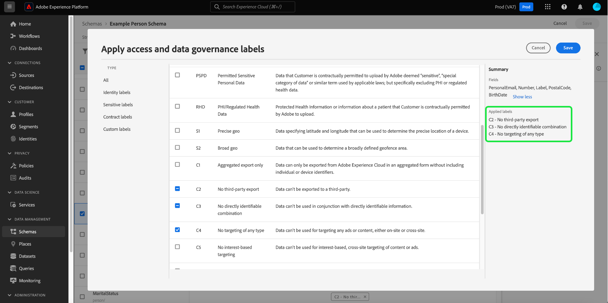

# 管理架构的数据使用标签

>[!IMPORTANT]
>
>基于模式的标签是 [基于属性的访问控制](../../access-control/abac/overview.md)，该版本目前在美国医疗保健客户的有限版本中提供。 此功能在完全发布后将可供所有Real-time Customer Data Platform客户使用。

引入Adobe Experience Platform的所有数据都受体验数据模型(XDM)架构的约束。 此数据可能受贵组织或法律法规定义的使用限制的约束。 为此，平台允许您通过使用 [数据使用标签](../../data-governance/labels/overview.md).

应用于架构字段的标签指示应用于该特定字段中包含的数据的使用策略。

虽然可以将标签应用于单个数据集（以及这些数据集中的字段），但您也可以在架构级别应用标签。 将标签直接应用于架构时，这些标签会传播到基于该架构的所有现有和未来数据集。

此外，在一个架构中添加的任何字段标签都会传播到使用共享类或字段组中相同字段的所有其他架构。 这有助于确保整个数据模型中类似字段的使用规则保持一致。

本教程介绍了在Platform UI中使用架构编辑器向架构添加标签的步骤。

## 快速入门

本指南要求您对Adobe Experience Platform的以下组件有一定的了解：

* [[!DNL Experience Data Model (XDM) System]](../home.md):标准化框架， [!DNL Experience Platform] 组织客户体验数据。
   * [架构编辑器](../ui/overview.md):了解如何在Platform UI中创建和管理模式和其他资源。
* [[!DNL Adobe Experience Platform Data Governance]](../../data-governance/home.md):提供基础架构，以便对平台操作实施数据使用限制，并使用策略来定义可以（或不能）对标记数据执行哪些营销操作。

## 选择一个架构或字段，以向

要开始添加标签，您必须先 [选择要编辑的现有架构](../ui/resources/schemas.md#edit) 或 [创建新模式](../ui/resources/schemas.md#create) 可在架构编辑器中查看其结构。

要编辑单个字段的标签，您可以在画布中选择该字段，然后选择 **[!UICONTROL 管理访问权限]** 中。

您还可以选择 **[!UICONTROL 标签]** 选项卡，从列表中选择所需的字段，然后选择 **[!UICONTROL 编辑管理标签]** 中。

![从 [!UICONTROL 标签] 选项卡](../images/tutorials/labels/select-field-on-labels-tab.png)

要编辑整个架构的标签，请选择铅笔图标() **[!UICONTROL 标签]** 选项卡。

![从 [!UICONTROL 标签] 选项卡](../images/tutorials/labels/select-schema-on-labels-tab.png)

>[!NOTE]
>
>当您首次尝试编辑架构或字段的标签时，会显示免责声明消息，说明标签使用情况对下游操作有何影响，具体取决于贵组织的策略。 选择 **[!UICONTROL 继续]** 继续编辑。
>
>

## 编辑架构或字段的标签

此时将显示一个对话框，用于编辑所选字段的标签。 如果您选择了单个对象类型字段，则右边栏会列出应用标签将传播到的子字段。

>[!NOTE]
>
>如果您正在编辑整个架构的字段，则右边栏不会列出适用的字段，而是显示架构名称。

使用显示的列表选择要添加到架构或字段的标签。 选择标签时， **[!UICONTROL 应用的标签]** 部分更新以显示迄今已选择的标签。

要按类型过滤显示的标签，请在左边栏中选择所需的类别。 要创建新的自定义标签，请选择 **[!UICONTROL 创建标签]**.

对所选标签满意后，选择 **[!UICONTROL 保存]** 以将其应用到字段或架构。

的 **[!UICONTROL 标签]** 选项卡，其中显示了架构应用的标签。

## 后续步骤

本指南介绍了如何管理架构和字段的数据使用标签。 有关管理数据使用情况标签（包括如何将它们添加到特定数据集而不是架构级别）的信息，请参阅 [数据使用标签UI指南](../../data-governance/labels/user-guide.md).
