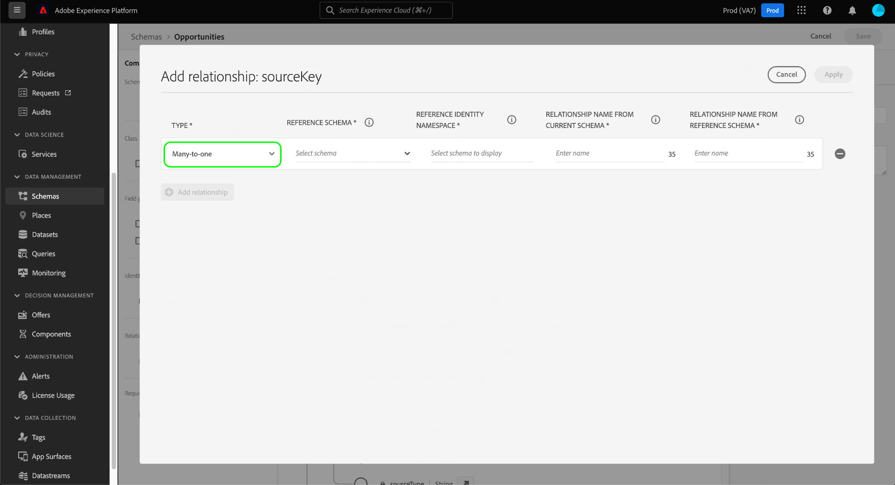

# 在 Real-Time Customer Data Platform B2B 版本中定义两个架构之间的多对一关系 {#relationship-b2b}

>[!CONTEXTUALHELP]
>id="platform_xdm_b2b_reference_schema"
>title="参考架构"
>abstract="选择要与之建立关系的架构。根据架构的类，它还可能与 B2B 上下文中的其他实体存在现有关系。请参阅文档以了解 B2B 架构类如何相互关联。"

Adobe Real-Time Customer Data Platform B2B edition提供了多个可捕获基本B2B数据实体的体验数据模型(XDM)类，包括[帐户](../classes/b2b/business-account.md)、[机会](../classes/b2b/business-opportunity.md)、[营销活动](../classes/b2b/business-campaign.md)等。 通过基于这些类构建架构并允许它们在[实时客户配置文件](../../profile/home.md)中使用，您可以将不同源中的数据合并到称为合并架构的统一表示中。

但是，合并架构只能包含由共享相同类的架构捕获的字段。 这就是架构关系发挥作用的地方。 通过在B2B架构中实施关系，您可以描述这些业务实体如何相互关联，并且可以在下游分段用例中包含来自多个类的属性。

下图提供了一个示例，说明在基本实施中，不同的B2B类如何相互关联：

本教程介绍了在Real-Time CDP B2B edition中定义两个架构之间的多对一关系的步骤。

>[!NOTE]
>
>如果您未使用Real-Time Customer Data Platform B2B edition或希望创建一对一关系，请另外参阅关于[创建一对一关系](./relationship-ui.md)的指南。
>
>本教程重点介绍如何在Experience Platform UI中手动建立B2B架构之间的关系。 如果您从B2B源连接引入数据，则可以使用自动生成实用程序创建所需的架构、身份和关系。 有关[使用自动生成实用程序](../../sources/connectors/adobe-applications/marketo/marketo-namespaces.md)的更多信息，请参阅有关B2B命名空间和架构的源文档。

## 快速入门

本教程需要您对[!DNL XDM System]和[!DNL Experience Platform] UI中的架构编辑器有一定的了解。 在开始本教程之前，请查看以下文档：

* Experience Platform中的[XDM System](../home.md)： [!DNL Experience Platform]中的XDM及其实现的概述。
* [架构组合的基础知识](../schema/composition.md)： XDM架构的构建块简介。
* [使用 [!DNL Schema Editor]](create-schema-ui.md)创建架构：一个教程，其中包含有关如何在UI中构建和编辑架构的基础知识。

## 定义源和引用架构

您应已创建将在关系中定义的两个架构。 出于演示目的，本教程将在业务机会（在“[!DNL Opportunities]”架构中定义）与其关联的业务帐户（在“[!DNL Accounts]”架构中定义）之间创建关系。

架构关系由&#x200B;**源架构**&#x200B;中的专用字段表示，该字段引用了&#x200B;**引用架构**&#x200B;的主要标识字段。 在接下来的步骤中，“[!DNL Opportunities]”用作源架构，而“[!DNL Accounts]”用作引用架构。

### 了解 B2B 关系中的身份标识

>[!CONTEXTUALHELP]
>id="platform_xdm_b2b_identity_namespace"
>title="参考身份标识命名空间"
>abstract="参考架构的主要身份标识字段的命名空间（类型）。参考架构必须有一个建立的主要身份标识字段才能参与关系。请参阅文档以了解有关 B2B 关系中的身份标识的更多信息。"

为了建立关系，引用架构必须具有定义的主标识。 在设置B2B实体的主要标识时，请记住，如果您在不同系统或位置上收集基于字符串的实体ID，则这些ID可能会重叠，这可能会导致Experience Platform中的数据冲突。

为此，所有标准B2B类都包含符合[[!UICONTROL B2B Source]数据类型](../data-types/b2b-source.md)的“key”字段。 此数据类型提供B2B实体的字符串标识符的字段，以及有关标识符源的其他上下文信息。 这些字段之一`sourceKey`连接数据类型中其他字段的值以生成实体的完全唯一标识符。 此字段应始终用作B2B实体架构的主要标识。

>[!NOTE]
>
>当[将XDM字段设置为标识](../ui/fields/identity.md)时，您必须提供标识命名空间以定义其下的标识。 这可以是Adobe提供的标准命名空间，也可以是您的组织定义的自定义命名空间。 实际上，命名空间只是一个上下文字符串，可以设置为任何您喜欢的值，前提是它对您的组织分类身份类型很有意义。 有关详细信息，请参阅[身份命名空间](../../identity-service/features/namespaces.md)的概述。

出于参考目的，以下几节介绍了在定义关系之前本教程中使用的每个架构的结构。 请注意在架构结构中定义主身份的位置以及它们使用的自定义命名空间。

### 机会模式

源架构“[!DNL Opportunities]”基于[!UICONTROL XDM Business Opportunity]类。 类`opportunityKey`提供的字段之一用作架构的标识符。 具体而言，`sourceKey`对象下的`opportunityKey`字段在名为[!DNL B2B Opportunity]的自定义命名空间下设置为架构的主要标识。

如在&#x200B;**[!UICONTROL Field Properties]**&#x200B;下看到的，此架构已启用以便在[!DNL Real-Time Customer Profile]中使用。

### [!DNL Accounts]架构

引用架构“[!DNL Accounts]”基于[!UICONTROL XDM Account]类。 根级别`accountKey`字段包含`sourceKey`，它在名为[!DNL B2B Account]的自定义命名空间下充当其主要标识。 此架构还被允许在配置文件中使用。

## 为源架构定义关系字段 {#relationship-field}

>[!CONTEXTUALHELP]
>id="platform_xdm_b2b_relationship_name_current"
>title="当前架构中的关系名称"
>abstract="描述当前架构与参考架构之间的关系的标签（例如，“相关帐户”）。此标签在轮廓和分段中用于为来自相关 B2B 实体的数据提供上下文。请参阅文档以了解有关生成 B2B 架构关系的更多信息。"

>[!CONTEXTUALHELP]
>id="platform_xdm_b2b_relationship_name_reference"
>title="参考架构中的关系名称"
>abstract="描述参考架构与当前架构之间的关系的标签（例如，“相关机会”）。此标签在轮廓和分段中用于为来自相关 B2B 实体的数据提供上下文。请参阅文档以了解有关生成 B2B 架构关系的更多信息。"

为了定义两个架构之间的关系，源架构必须具有指示引用架构的主要标识的专用字段。 标准B2B类包括用于通常相关的业务实体的专用源密钥字段。 例如，[!UICONTROL XDM Business Opportunity]类包含相关帐户(`accountKey`)和相关营销活动(`campaignKey`)的源键字段。 但是，如果需要的组件多于默认组件，则还可以使用自定义字段组将其他[!UICONTROL B2B Source]字段添加到架构。

>[!NOTE]
>
>目前，只能定义从源架构到引用架构的多对一和一对一关系。 对于一对多关系，必须在表示“多个”的架构中定义关系字段。

要设置关系字段，请在画布中选择有问题的字段，然后在&#x200B;**[!UICONTROL Add relationship]**&#x200B;侧边栏中选择[!UICONTROL Schema properties]。 对于[!DNL Opportunities]架构，这是`accountKey.sourceKey`字段，因为目标是与帐户建立多对一关系。

出现[!UICONTROL Add relationship]对话框。 使用此对话框指定关系详细信息。 默认情况下，关系类型设置为&#x200B;**[!UICONTROL Many-to-one]**。

在&#x200B;**[!UICONTROL Reference Schema]**&#x200B;下，使用搜索栏或下拉菜单查找引用架构的名称。 当您突出显示引用架构的名称时，**[!UICONTROL Reference Identity Namespace]**&#x200B;字段会自动更新为引用架构主要标识的命名空间。

>[!NOTE]
>
>将筛选可用引用架构列表，以仅包含合适的架构。 架构&#x200B;**必须**&#x200B;具有分配的主标识，并且是B2B类或个人资料类。 目标客户类架构不能具有关系。

在&#x200B;**[!UICONTROL Relationship Name From Current Schema]**&#x200B;和&#x200B;**[!UICONTROL Relationship Name From Reference Schema]**&#x200B;下，分别为源和引用架构上下文中的关系提供友好名称。 完成后，选择&#x200B;**[!UICONTROL Apply]**&#x200B;以确认更改并保存关系。

>[!NOTE]
>
>关系名称不得超过35个字符。

画布会重新显示，其中关系字段现在使用您之前提供的友好名称进行标记。 关系名称也会列在左边栏上以便参考。

如果您查看引用架构的结构，则关系标记将显示在架构的主标识字段旁边和左边栏中。

## 编辑B2B架构关系 {#edit-schema-relationship}

建立架构关系后，在源架构中选择关系字段，后跟&#x200B;**[!UICONTROL Edit relationship]**。

>[!NOTE]
>
>要查看所有关联关系，请选择引用架构中的主标识字段，后跟[!UICONTROL View relationships]。
>{width="100" zoomable="yes"}

出现[!UICONTROL Edit relationship]对话框。 从该对话框中，您可以更改引用架构和关系名称，或删除关系。 无法更改多对一关系类型。

要维护数据完整性并避免分段和其他流程中出现中断，请在管理架构与链接数据集的关系时考虑以下准则：

* 如果架构与数据集关联，请避免直接删除关系，因为这可能会对分段产生负面影响。 相反，请在删除关系之前删除关联的数据集。
* 如果不先删除现有关系，则无法更改引用架构。 但是，应当谨慎执行此操作，因为删除与关联数据集的关系可能会产生意想不到的结果。
* 向包含现有链接数据集的架构添加新关系可能无法按预期工作，并且可能会导致潜在冲突。

## 筛选和搜索关系 {#filter-and-search}

您可以从[!UICONTROL Relationships]工作区的[!UICONTROL Schemas]选项卡筛选和搜索架构中的特定关系。 您可以使用此视图快速找到和管理您的关系。 有关筛选选项的详细说明，请阅读有关[浏览架构资源](../ui/explore.md#lookup)的文档。

## 后续步骤

通过学习本教程，您已使用[!DNL Schema Editor]成功地创建了两个架构之间的多对一关系。 使用基于这些架构的数据集摄取数据，并在配置文件数据存储中激活该数据后，即可将这两个架构中的属性用于[多类分段用例](../../rtcdp/segmentation/b2b.md)。
