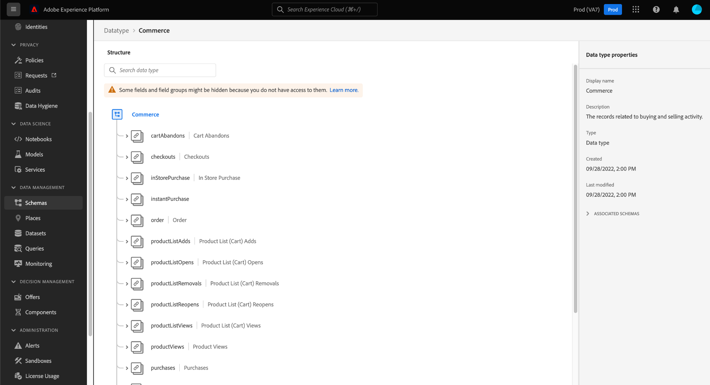
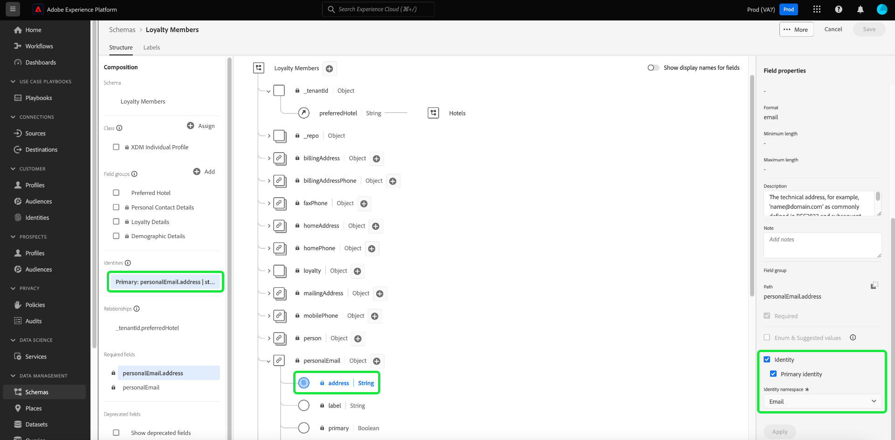

# 浏览UI中的架构资源

在Adobe Experience Platform中，所有Experience Data Model (XDM)架构资源都存储在 [!DNL Schema Library]，包括由Adobe提供的标准资源和由贵组织定义的自定义资源。 在Experience PlatformUI中，您可以在中查看任何现有架构、类、字段组或数据类型的结构和字段 [!DNL Schema Library]. 在规划和准备数据引入时，此功能特别有用，因为UI提供了有关这些XDM资源提供的每个字段的预期数据类型和用例的信息。

本教程介绍了在Experience PlatformUI中浏览现有架构、类、字段组和数据类型的步骤。

## 查找架构资源 {#lookup}

在Platform UI中，选择 **[!UICONTROL 架构]** 在左侧导航中。 此 [!UICONTROL 架构] 工作区提供 **[!UICONTROL 浏览]** 选项卡，浏览组织中的所有架构，以及其他用于浏览的专用选项卡 **[!UICONTROL 类]**， **[!UICONTROL 字段组]**、和 **[!UICONTROL 数据类型]** 的量度。

过滤器图标()在左边栏中显示控件，以缩小列出的结果的范围。 根据所列的资源类型，显示的控件会有所不同。

例如，要筛选列表以仅显示Adobe提供的标准数据类型，请选择 **[!UICONTROL 数据类型]** 和 **[!UICONTROL Adobe]** 在 **[!UICONTROL 类型]** 和 **[!UICONTROL 所有者]** 部分。

此 **[!UICONTROL 包含在配置文件中]** 切换允许您筛选结果，以仅显示已允许在架构中使用的资源 [Real-time Customer Profile](../../profile/home.md). 此 **[!UICONTROL 显示临时架构]** 切换筛选器使用仅由单个数据集使用的命名空间字段创建的架构列表。

![此 [!UICONTROL 架构] 工作区 [!UICONTROL 浏览] 选项卡，并将过滤器面板高亮显示。](../images/ui/explore/filter.png)

将资源列在 **[!UICONTROL 类]**， **[!UICONTROL 字段组]**，或 **[!UICONTROL 数据类型]** 选项卡，您可以选择 **[!UICONTROL Adobe]** 以仅显示标准资源或 **[!UICONTROL 客户]** 以仅显示您的组织创建的资源。

您还可以使用搜索栏进一步缩小结果的范围。

搜索结果中显示的资源首先按标题匹配项排序，然后按说明匹配项排序。 反过来，这两个类别中的匹配词越多，列表中显示的资源就越多。

找到要浏览的资源后，从列表中选择其名称，以在画布中查看其结构。

## 在画布中浏览XDM资源 {#explore}

选择资源后，其结构将在画布中打开。

默认情况下，包含子属性的所有对象类型字段在首次出现在画布中时会折叠。 要显示任何字段的子属性，请选择其名称旁边的图标。

### 标准类和字段组指示器 {#standard-class-and-field-group-indicator}

在架构编辑器中，标准(Adobe生成的)类和字段组用挂锁图标(的问题。挂锁显示在左边栏中的类或字段组名称旁边，以及架构图中作为系统生成资源一部分的任意字段旁边。

请参阅 [将自定义字段添加到标准字段组](./resources/schemas.md) 指导文档。 不能编辑标准类。

### 系统生成的字段 {#system-fields}

某些字段名称的前面带有下划线，例如 `_repo` 和 `_id`. 这些表示系统将在摄取数据时自动生成和分配的字段的占位符。

因此，在摄取到Platform中时，应该从数据的结构中排除这些字段中的大多数。 此规则的主要例外是 [`_{TENANT_ID}` 字段](../api/getting-started.md#know-your-tenant_id)，贵组织下创建的所有XDM字段都必须命名于其中。

### 数据类型 {#data-types}

对于画布中显示的每个字段，其对应的数据类型会显示在名称旁边，这概览field希望摄取的数据类型。

任何附加了方括号(`[]`)表示该特定数据类型的数组。 例如，数据类型为 **[!UICONTROL 字符串]\[]** 表示该字段需要字符串值的数组。 数据类型 **[!UICONTROL 付款项目]\[]** 表示符合 [!UICONTROL 付款项目] 数据类型。

如果数组字段基于对象类型，则可以在画布中选择其图标，以显示每个数组项的预期属性。

### [!UICONTROL 字段属性] {#field-properties}

选择画布中任意字段的名称后，右边栏会更新，以在下显示有关该字段的详细信息 **[!UICONTROL 字段属性]**. 这可以包括字段的预期用例、默认值、模式、格式、字段是否为必填等的描述。

如果您要检查的字段是枚举字段，则右边栏还会显示该字段预期接收的可接受值。

### 标识字段 {#identity}

检查包含身份字段的架构时，这些字段在左边栏中列在提供给架构的类或字段组下。 选择左边栏中的身份字段名称以显示画布中的字段，无论其嵌套深度如何。

标识字段在画布中用指纹图标()。 如果选择身份字段的名称，则可以查看附加信息，例如 [身份命名空间](../../identity-service/features/namespaces.md) 以及字段是否是架构的主要标识。

>[!NOTE]
>
>请参阅指南，网址为 [定义标识字段](./fields/identity.md) 以了解有关标识字段及其与其与下游Platform服务的关系的更多信息。

### 关系字段 {#relationship}

如果要检查包含关系字段的架构，则该字段将列在左边栏中的 **[!UICONTROL 关系]**. 选择左边栏中的关系字段名称以显示画布中的字段，无论其嵌套深度如何。

关系字段在画布中也以唯一方式高亮显示，显示字段链接到的引用架构的名称。 如果选择关系字段的名称，则可以在右边栏中查看引用架构主要身份的身份命名空间。

>[!NOTE]
>
>请参阅上的教程 [在用户界面中创建关系](../tutorials/relationship-ui.md) 有关在XDM架构中使用关系的更多信息。

## 后续步骤

本文档介绍了如何在Experience PlatformUI中探索现有XDM资源。 有关 [!UICONTROL 架构] 工作区和 [!DNL Schema Editor]，请参见 [[!UICONTROL 架构] 工作区概述](./overview.md).
