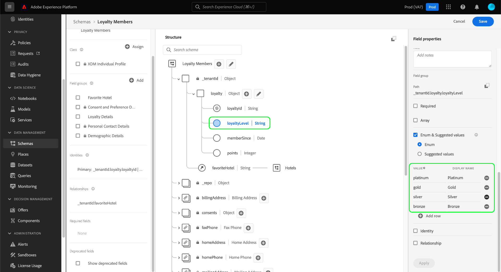

# 在UI中浏览XDM资源

在Adobe Experience Platform，所有体验数据模型(XDM)资源都存储在[!DNL Schema Library]中，包括由Adobe提供的标准资源和由您的组织定义的自定义资源。 在Experience PlatformUI中，您可以视图[!DNL Schema Library]中任何现有模式、类、混音或数据类型的结构和字段。 在规划和准备数据摄取时，此功能尤为有用，因为UI提供了有关这些XDM资源提供的每个字段的预期数据类型和使用案例的信息。

本教程介绍了在Experience PlatformUI中探索现有模式、类、混合和数据类型的步骤。

## 查找XDM资源{#lookup}

在平台UI中，在左侧导航中选择&#x200B;**[!UICONTROL 模式]**。 [!UICONTROL 模式]工作区提供&#x200B;**[!UICONTROL 浏览]**&#x200B;选项卡，用于浏览您组织中的所有现有XDM资源，以及额外的专用选项卡，用于专门探索&#x200B;**[!UICONTROL 类]**、**[!UICONTROL 混合]**&#x200B;和&#x200B;**[!UICONTROL 数据类型]**。

在[!UICONTROL 浏览]选项卡上，可以使用过滤器图标（）显示左边栏中的控件以缩小列出的结果。

例如，要过滤列表以仅显示Adobe提供的标准数据类型，请分别在&#x200B;**[!UICONTROL 类型]**&#x200B;和&#x200B;**[!UICONTROL 所有者]**&#x200B;节下选择&#x200B;**[!UICONTROL 数据类型]**&#x200B;和&#x200B;**[!UICONTROL Adobe]**。

通过用户档案&#x200B;]**中的**[!UICONTROL &#x200B;切换，可以过滤结果，以仅显示已启用在[实时客户用户档案](../../profile/home.md)中使用的模式中使用的资源。

您还可以使用搜索栏进一步缩小结果范围。 搜索词时，顶级项目表示名称与搜索查询匹配的资源。 在这些项目下，在&#x200B;**[!UICONTROL 标准字段]**&#x200B;下，将列出包含与查询匹配的字段的所有资源。 这样，您就可以根据XDM包含的数据类型搜索XDM资源，而无需事先知道资源的名称。

找到要浏览的资源后，从列表中选择其名称，在画布中视图其结构。

## 在画布{#explore}中浏览XDM资源

选择资源后，其结构将在画布中打开。

默认情况下，包含子属性的所有对象类型字段首次出现在画布中时都会折叠。 要显示任何字段的子属性，请选择其名称旁的图标。

### 系统生成的字段{#system-fields}

某些字段名称以下划线作为前缀，如`_repo`和`_id`。 这些表示在摄取数据时系统将自动生成并分配的字段的占位符。

因此，在引入平台时，这些字段中的大多数应排除在数据结构中。 此规则的主要例外是[`_{TENANT_ID}`字段](../api/getting-started.md#know-your-tenant_id)，您的组织下创建的所有XDM字段都必须以字段命名。

### 数据类型 {#data-types}

对于画布中显示的每个字段，其相应的数据类型显示在其名称旁边，一览表中显示了字段需要摄取的数据类型。

附加方括号(`[]`)的任何数据类型都表示该特定数据类型的数组。 例如，**[!UICONTROL String]\[]**&#x200B;的数据类型表示字段需要字符串值的数组。 **[!UICONTROL 支付项]\[]**&#x200B;数据类型指示符合[!UICONTROL 支付项]数据类型的对象数组。

如果数组字段基于对象类型，您可以在画布中选择其图标以显示每个数组项的预期属性。

### [!UICONTROL 字段属性] {#field-properties}

在画布中选择任何字段的名称时，右边栏会更新，显示&#x200B;**[!UICONTROL 字段属性]**&#x200B;下有关该字段的详细信息。 这可以包括字段的预期用例描述、默认值、模式、格式、字段是否必需等。

如果您正在检查的字段是枚举字段，则右边栏还将显示该字段希望接收的可接受值。

### 标识字段{#identity}

在检查包含身份字段的模式时，这些字段列在类下的左边栏中或提供给模式的混音中。 在左边栏中选择标识字段名称以在画布中显示该字段，而不管它嵌套的深度如何。

在画布中，标识字段会突出显示，并带有指纹图标（）。 如果选择标识字段的名称，则可以视图其他信息，如[标识命名空间](../../identity-service/namespaces.md)，以及字段是否是模式的主标识。

>[!NOTE]
>
>有关标识字段及其与下游平台服务的关系的详细信息，请参见[定义标识字段](./fields/identity.md)的指南。

### 关系字段{#relationship}

如果您正在检查包含关系字段的模式，该字段将列在左边栏的&#x200B;**[!UICONTROL 关系]**&#x200B;下。 在左边栏中选择关系字段名称以在画布中显示该字段，而不管它嵌套的深度如何。

在画布中，关系字段也以唯一方式突出显示，显示字段引用的目标模式的名称。 如果选择关系字段的名称，则可以在右边栏中视图目标模式的主标识的标识命名空间。

>[!NOTE]
>
>有关在XDM模式中使用关系的更多信息，请参阅有关在UI](../tutorials/create-schema-ui.md)中创建关系的教程。[

## 后续步骤

本文档介绍如何在Experience PlatformUI中探索现有XDM资源。 有关[!UICONTROL 模式]工作区和[!DNL Schema Editor]的不同功能的详细信息，请参阅[[!UICONTROL 模式]工作区概述](./overview.md)。