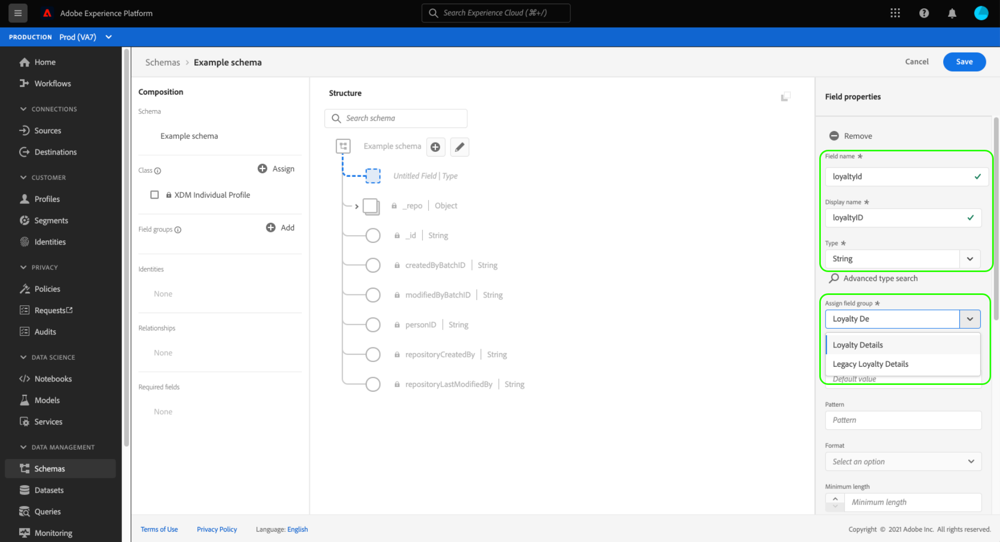
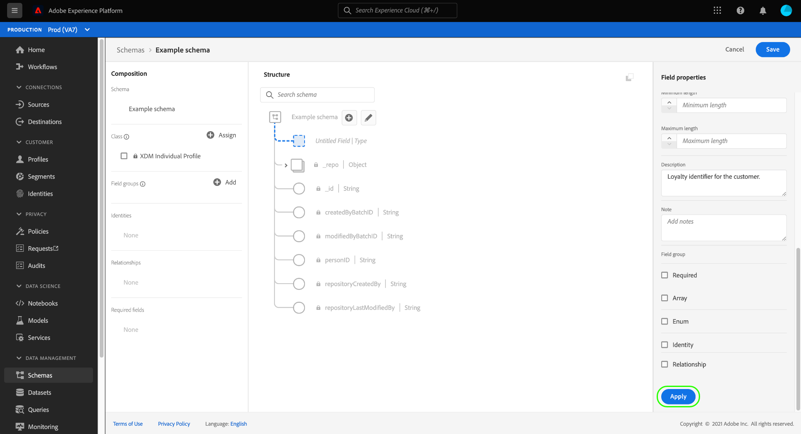
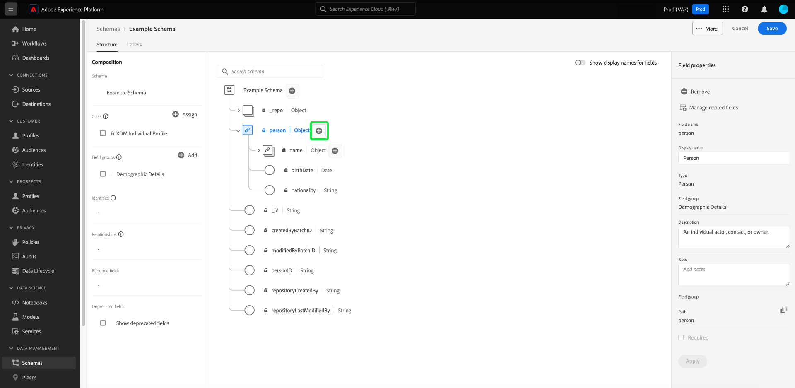

# 架构编辑器中的基于字段的工作流

Adobe Experience Platform提供一组可靠的标准化[字段组](../schema/composition.md#field-group)，用于体验数据模型(XDM)架构。 这些字段组背后的结构和语义经过仔细设计，可满足Experience Platform中的各种分段用例和其他下游应用程序。 您还可以定义自己的自定义字段组，以满足独特的业务需求。

将字段组添加到架构时，该架构会继承该组中包含的所有字段。 但是，您现在可以将单个字段添加到架构中，而无需包含您可能不一定使用的关联字段组中的其他字段。

本指南介绍了在Experience Platform UI中将各个字段添加到架构的各种方法。

## 先决条件

本教程假设您熟悉XDM架构的[构成](../schema/composition.md)以及如何在Experience Platform UI中使用架构编辑器。 若要继续，您应该开始[创建新架构](./resources/schemas.md)并将其分配给标准类的过程，然后再继续本指南。

## 移除从标准字段组添加的字段 {#remove-field-group}

将标准字段组添加到架构后，您可以删除任何不需要的标准字段。

>[!NOTE]
>
>从标准字段组中删除字段只会影响正在处理的架构，而不会影响字段组本身。 如果移除一个架构中的标准字段，则这些字段在使用相同字段组的所有其他架构中仍然可用。

在以下示例中，标准字段组&#x200B;**[!UICONTROL 人口统计详细信息]**&#x200B;已添加到架构中。 要删除单个字段，如`maritalStatus`，请在画布中选择该字段，然后在右边栏中选择&#x200B;**[!UICONTROL 删除]**。

如果要删除多个字段，则可以整体管理字段组。 在画布中选择属于该组的字段，然后在右边栏中选择&#x200B;**[!UICONTROL 管理相关字段]**。

此时将显示一个对话框，其中显示了相关字段组的结构。 在此，您可以使用提供的复选框选择或取消选择所需的字段。 如果满意，请选择&#x200B;**[!UICONTROL 确认]**。

画布会重新显示，架构结构中仅显示选定的字段。

## 将标准字段直接添加到架构

您可以将标准字段组中的字段直接添加到架构中，而无需预先知道其对应的字段组。 要将标准字段添加到架构，请在画布中选择架构名称旁边的加号(**+**)图标。 架构结构中出现&#x200B;**[!UICONTROL 无标题字段]**&#x200B;占位符，右边栏更新显示用于配置该字段的控件。

在&#x200B;**[!UICONTROL 字段名称]**&#x200B;下，开始键入要添加的字段名称。 系统会自动搜索与查询匹配的标准字段，并在&#x200B;**[!UICONTROL 推荐的标准字段]**&#x200B;下列出它们，包括它们所属的字段组。

虽然某些标准字段具有相同的名称，但它们的结构可能会因它们来自的字段组而异。 如果标准字段嵌套在字段组结构的父对象中，则添加子字段时，该父字段也将包含在架构中。

选择标准字段旁边的预览图标（）可查看其字段组的结构，并更好地了解其嵌套方式。 要将标准字段添加到架构，请选择加号图标（）。

画布将更新以显示添加到架构的标准字段，包括嵌套在字段组结构下的任何父字段。 字段组的名称还列在左边栏中的&#x200B;**[!UICONTROL 字段组]**&#x200B;下。 如果要从同一字段组添加更多字段，请选择右边栏中的&#x200B;**[!UICONTROL 管理相关字段]**。

## 将自定义字段直接添加到架构

与标准字段的工作流类似，您还可以将自己的自定义字段直接添加到架构。

要将字段添加到架构的根级别，请在画布中选择架构名称旁边的加号(**+**)图标。 架构结构中出现&#x200B;**[!UICONTROL 无标题字段]**&#x200B;占位符，右边栏更新显示用于配置该字段的控件。

开始键入要添加的字段的名称，系统会自动开始搜索匹配的标准字段。 要创建新的自定义字段，请选择附加了&#x200B;**（[!UICONTROL 新字段]）**&#x200B;的顶部选项。

在此处，提供字段的显示名称和数据类型。 在&#x200B;**[!UICONTROL 分配字段组]**&#x200B;下，必须为要关联的新字段选择一个字段组。 开始键入字段组的名称，如果您之前[已创建自定义字段组](./resources/field-groups.md#create)，则它们将显示在下拉列表中。 或者，您可以在字段中键入唯一名称以创建新字段组。

>[!WARNING]
>
>如果选择现有的自定义字段组，则采用该字段组的任何其他架构在保存更改后也将继承新添加的字段。 因此，如果您希望进行这种类型的传播，请仅选择现有的字段组。 否则，您应该选择创建新的自定义字段组。

完成后，选择&#x200B;**[!UICONTROL 应用]**。

在架构编辑器的字段属性中突出显示

新字段已添加到画布中，并且已在您的[租户ID](../api/getting-started.md#know-your-tenant_id)下命名，以避免与标准XDM字段冲突。 与新字段关联的字段组也显示在左边栏中的&#x200B;**[!UICONTROL 字段组]**&#x200B;下。

>[!NOTE]
>
>默认情况下，所选自定义字段组提供的其余字段将从架构中删除。 如果要将其中一些字段添加到架构，请选择属于该组的字段，然后在右边栏中选择&#x200B;**[!UICONTROL 管理相关字段]**。

### 向标准字段组的结构中添加自定义字段

如果您正在处理的架构具有由标准字段组提供的对象类型字段，则可以将自己的自定义字段添加到该标准对象。 选择对象根旁边的加号(**+**)图标。

>[!IMPORTANT]
>
>在一个架构中添加到字段组的任何字段也将出现在使用该字段组的所有其他架构中。

有关添加自定义字段的更多信息，请参阅UI指南](./resources/schemas.md#custom-fields-for-standard-groups)中的[创建和编辑架构。

## 后续步骤

本指南介绍了Experience Platform UI中模式编辑器的新的基于字段的工作流。 有关在UI中管理架构的更多信息，请参阅[UI概述](./overview.md)。
