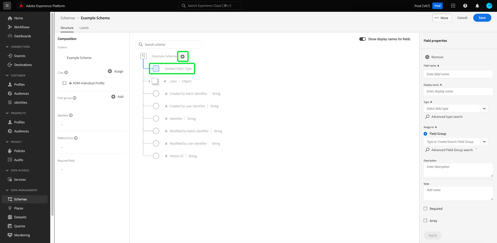

# 架构编辑器中的基于字段的工作流

Adobe Experience Platform提供了一组强大的标准化设置 [字段组](../schema/composition.md#field-group) 用于Experience Data Model (XDM)架构。 这些字段组背后的结构和语义经过仔细设计，可满足各种分段用例和Platform中的其他下游应用程序。 您还可以定义自己的自定义字段组，以满足独特的业务需求。

将字段组添加到架构时，该架构会继承该组中包含的所有字段。 但是，您现在可以将单个字段添加到架构中，而无需包含您可能不一定使用的关联字段组中的其他字段。

本指南介绍了在Platform UI中将各个字段添加到架构的不同方法。

## 先决条件

本教程假定您熟悉 [XDM模式的组合](../schema/composition.md) 以及如何在Platform UI中使用架构编辑器。 要继续操作，您应该开始 [创建新架构](./resources/schemas.md) 并将其分配到标准类中，然后再继续本指南。

## 移除从标准字段组添加的字段 {#remove-field-group}

将标准字段组添加到架构后，您可以删除任何不需要的标准字段。

>[!NOTE]
>
>从标准字段组中删除字段只会影响正在处理的架构，而不会影响字段组本身。 如果移除一个架构中的标准字段，则这些字段在使用相同字段组的所有其他架构中仍然可用。

在以下示例中，标准字段组 **[!UICONTROL 人口统计详细信息]** 已添加到架构。 要删除单个字段，如 `taxId`，选择画布中的字段，然后选择 **[!UICONTROL 移除]** 在右边栏中。

如果要删除多个字段，则可以整体管理字段组。 在画布中选择属于该组的字段，然后选择 **[!UICONTROL 管理相关字段]** 在右边栏中。

此时将显示一个对话框，其中显示了相关字段组的结构。 在此，您可以使用提供的复选框选择或取消选择所需的字段。 如果满意，请选择 **[!UICONTROL 确认]**.

画布会重新显示，架构结构中仅显示选定的字段。

## 将标准字段直接添加到架构

您可以将标准字段组中的字段直接添加到架构中，而无需预先知道其对应的字段组。 要将标准字段添加到架构，请选择加号(**+**)图标图标。 An **[!UICONTROL 无标题的字段]** 架构结构和右边栏更新中显示占位符，以显示用于配置该字段的控件。

下 **[!UICONTROL 字段名称]**，开始键入要添加的字段的名称。 系统会自动搜索与查询匹配的标准字段，并在下面列出它们 **[!UICONTROL 推荐的标准字段]**，包括它们所属的字段组。

虽然某些标准字段具有相同的名称，但它们的结构可能会因它们来自的字段组而异。 如果标准字段嵌套在字段组结构的父对象中，则添加子字段时，该父字段也将包含在架构中。

选择预览图标()，以查看其字段组的结构，并更好地了解其嵌套方式。 要将标准字段添加到架构，请选择加号图标()。

画布将更新以显示添加到架构的标准字段，包括嵌套在字段组结构下的任何父字段。 字段组的名称也会列在 **[!UICONTROL 字段组]** 在左边栏中。 如果要从同一字段组添加更多字段，请选择 **[!UICONTROL 管理相关字段]** 在右边栏中。

## 将自定义字段直接添加到架构

与标准字段的工作流类似，您还可以将自己的自定义字段直接添加到架构。

要将字段添加到架构的根级别，请选择加号(**+**)图标图标。 An **[!UICONTROL 无标题的字段]** 架构结构和右边栏更新中显示占位符，以显示用于配置该字段的控件。

开始键入要添加的字段的名称，系统会自动开始搜索匹配的标准字段。 要创建新的自定义字段，请选择附加了的顶部选项 **([!UICONTROL 新建字段])**.

在此处，提供字段的显示名称和数据类型。 下 **[!UICONTROL 分配字段组]**&#x200B;中，您必须为要关联的新字段选择字段组。 开始键入字段组的名称，如果您之前已输入 [已创建自定义字段组](./resources/field-groups.md#create) 它们将显示在下拉列表中。 或者，您可以在字段中键入唯一名称以创建新字段组。

>[!WARNING]
>
>如果选择现有的自定义字段组，则采用该字段组的任何其他架构在保存更改后也将继承新添加的字段。 因此，如果您希望进行这种类型的传播，请仅选择现有的字段组。 否则，您应该选择创建新的自定义字段组。

完成后，选择 **[!UICONTROL 应用]**.

新字段将添加到画布中，并在 [租户ID](../api/getting-started.md#know-your-tenant_id) 以避免与标准XDM字段冲突。 与新字段关联的字段组也会显示在 **[!UICONTROL 字段组]** 在左边栏中。

>[!NOTE]
>
>默认情况下，所选自定义字段组提供的其余字段将从架构中删除。 如果要将其中一些字段添加到架构，请选择属于该组的字段，然后选择 **[!UICONTROL 管理相关字段]** 在右边栏中。

### 向标准字段组的结构中添加自定义字段

如果您正在处理的架构具有由标准字段组提供的对象类型字段，则可以将自己的自定义字段添加到该标准对象。 选择加号(**+**)图标，并在右边栏中提供自定义字段的详细信息。

应用更改后，新字段将显示在标准对象内的租户ID命名空间下。 此嵌套命名空间可防止字段组自身内的字段名称冲突，以避免破坏使用同一字段组的其他架构中的更改。

## 后续步骤

本指南介绍了Platform UI中模式编辑器的新的基于字段的工作流。 有关在UI中管理架构的更多信息，请参阅 [UI概述](./overview.md).
