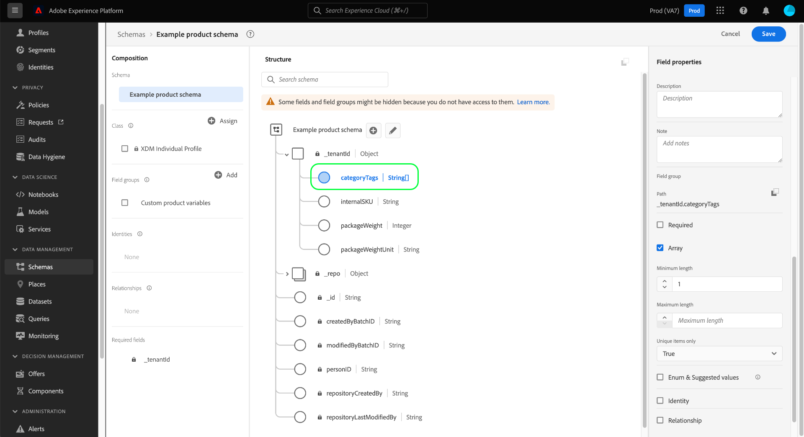

# 在UI中定义数组字段

在Adobe Experience Platform用户界面中定义体验数据模型(XDM)字段时，可以将该字段指定为数组。

数组的内容取决于为该字段选择的[!UICONTROL 类型]。 例如，如果字段的[!UICONTROL Type]设置为“[!UICONTROL String]”，则将该字段设置为数组会将该字段指定为字符串数组。 如果字段的[!UICONTROL 类型]设置为多字段数据类型，如“[!UICONTROL 邮政地址]”，则该字段将成为符合数据类型的邮政地址对象的数组。

在UI](./overview.md#define)中定义了[新字段后，可以选中右边栏中的&#x200B;**[!UICONTROL Array]**&#x200B;复选框，将其设置为数组字段。

选中该复选框后，右边栏中会显示其他控件，允许您选择进一步限制数组。 如果您不想强制实施特定约束，请将字段留空。

阵列的其他配置控件如下：

| 字段属性 | 描述 |
| --- | --- |
| [!UICONTROL 最小长度] | 阵列必须包含的最小项数，才能成功摄取。 |
| [!UICONTROL 最大长度] | 要成功摄取，阵列必须包含的最大项目数。 |
| [!UICONTROL 仅唯一项目] | 如果设置为“[!UICONTROL True]”，则数组中的每个项必须是唯一的，才能成功获取。 |

完成字段配置后，选择&#x200B;**[!UICONTROL 应用]**&#x200B;以将更改应用到模式。

画布会更新，以反映对字段所做的更改。 请注意，画布中字段名称旁边显示的数据类型会附加一对方括号(`[]`)，表示该字段代表该数据类型的数组。

## 后续步骤

本指南介绍如何在UI中定义阵列字段。 请参见[定义UI](./overview.md#special)中的字段的概述，了解如何定义[!DNL Schema Editor]中的其他XDM字段类型。