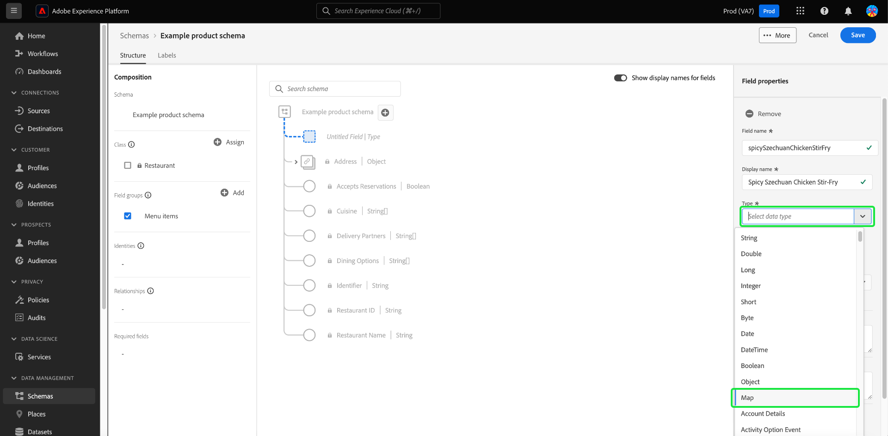

# 在UI中定义映射字段

Adobe Experience Platform允许您完全自定义自定义Experience Data Model (XDM)类、架构字段组和数据类型的结构。

您还可以在架构编辑器中定义映射字段，以建模灵活的动态数据结构或存储键值对的集合。 地图数据结构允许高效而快速地查找、插入和删除基于唯一标识符组织和访问信息的位置。

在Platform用户界面(UI)中定义新字段时，使用 **[!UICONTROL 类型]** 下拉并选择&quot;**[!UICONTROL 地图]**”从列表中删除。

A [!UICONTROL 映射值类型] 属性出现。 此值是必需的 [!UICONTROL 地图] 数据类型。 映射的可用值包括 [!UICONTROL 字符串] 和 [!UICONTROL 整数]. 从可用选项的下拉列表中选择一个值。

![使用的架构编辑器 [!UICONTROL 映射值类型] 下拉列表突出显示。](../../images/ui/fields/special/map-value-type.png)

配置子字段后，必须将其分配给字段组。 使用 **[!UICONTROL 字段组]** 下拉菜单或搜索字段，然后选择 **[!UICONTROL 应用]**. 您可以使用相同的过程继续向对象添加字段，或选择 **[!UICONTROL 保存]** 以确认您的设置。

>[!NOTE]
>
>Platform UI在如何提取映射类型字段的键值方面存在限制。 虽然对象类型字段可以展开，但映射显示为一个字段。 通过架构注册表API创建的不是字符串或整数数据类型的映射字段显示为&quot;[!UICONTROL 复杂]”数据类型。

## 后续步骤

阅读本文档后，您现在可以在Platform UI中定义映射字段。 请记住，您只能使用类和字段组向架构添加字段。 要详细了解如何在UI中管理这些资源，请参阅有关创建和编辑的指南 [类](../resources/classes.md) 和 [字段组](../resources/field-groups.md).

欲知关于 [!UICONTROL 架构] 工作区，请参见 [[!UICONTROL 架构] 工作区概述](../overview.md).
