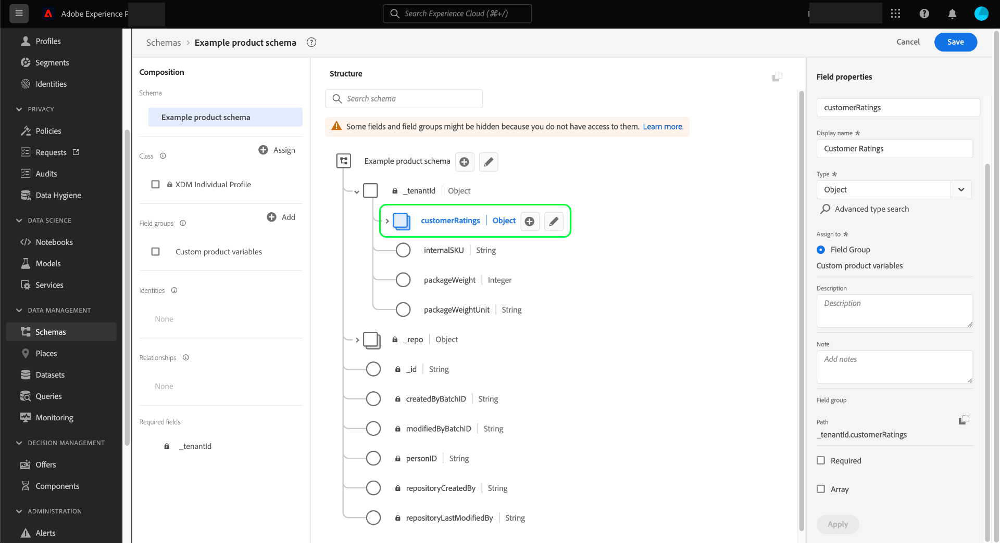
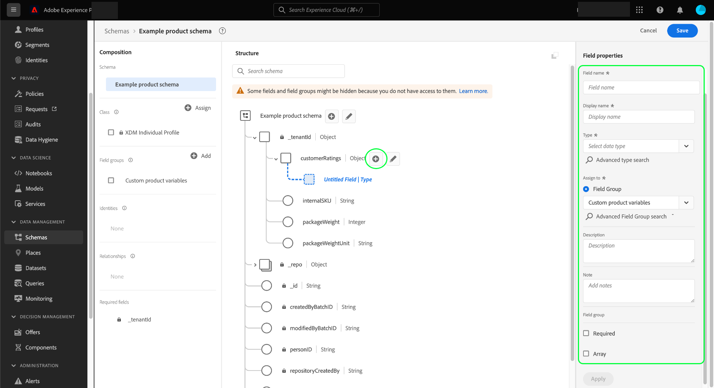

# 在UI中定义对象字段

Adobe Experience Platform允许您完全自定义自定义Experience Data Model (XDM)类、架构字段组和数据类型的结构。 为了在自定义XDM资源中组织和嵌套相关字段，可以定义可包含其他子字段的对象类型字段。

在Adobe Experience Platform用户界面中[定义新字段](./overview.md#define)时，请使用&#x200B;**[!UICONTROL 类型]**&#x200B;下拉菜单并从列表中选择“[!UICONTROL 对象]”。

选择&#x200B;**[!UICONTROL 应用]**&#x200B;以将该对象添加到架构。 画布将更新以显示应用了[!UICONTROL 对象]数据类型的新字段，包括用于编辑子字段并将其添加到该对象的控件。

要添加子字段，请选择画布中对象字段旁边的&#x200B;**加号(+)**&#x200B;图标。 对象下方将显示一个新字段，其中包含用于在右边栏中配置子字段的控件。

配置子字段并选择&#x200B;**[!UICONTROL 应用]**&#x200B;后，可使用相同的进程继续将字段添加到对象。 您还可以添加作为对象本身的子字段，从而允许嵌套任意深度的字段。

完成对象的构建后，您可能会发现希望在不同类和字段组中重用其结构。 在这种情况下，您可以选择将对象转换为数据类型。 有关详细信息，请参阅数据类型UI指南中有关[将对象转换为数据类型](../resources/data-types.md#convert)的部分。

## 后续步骤

本指南介绍了如何在UI中定义对象字段。 请参阅[在UI](./overview.md#special)中定义字段的概述，了解如何在[!DNL Schema Editor]中定义其他XDM字段类型。
