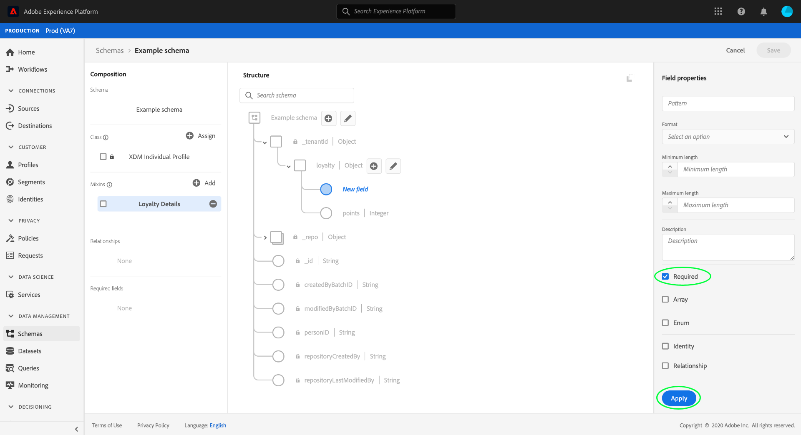

# 在UI中定义必填字段

在体验事件模型(XDM)中，必填字段指示必须提供有效值，才能在数据获取过程中接受特定记录或时间序列数据。 必填字段的常见用例包括用户身份信息和时间戳。

当[在Adobe Experience Platform用户界面中定义新字段](./overview.md#define)时，您可以通过选中右边栏中的&#x200B;**[!UICONTROL Required]**&#x200B;复选框将其设置为必填字段。 选择&#x200B;**[!UICONTROL 应用]**&#x200B;以将更改应用于模式。

应用字段后，其路径将显示在左边栏的&#x200B;**[!UICONTROL 必填字段]**&#x200B;下。 如果字段是嵌套字段，则任何父字段也将根据需要显示。

## 后续步骤

本指南介绍如何在UI中定义必填字段。 请参见[定义UI](./overview.md#special)中的字段的概述，了解如何定义[!DNL Schema Editor]中的其他XDM字段类型。