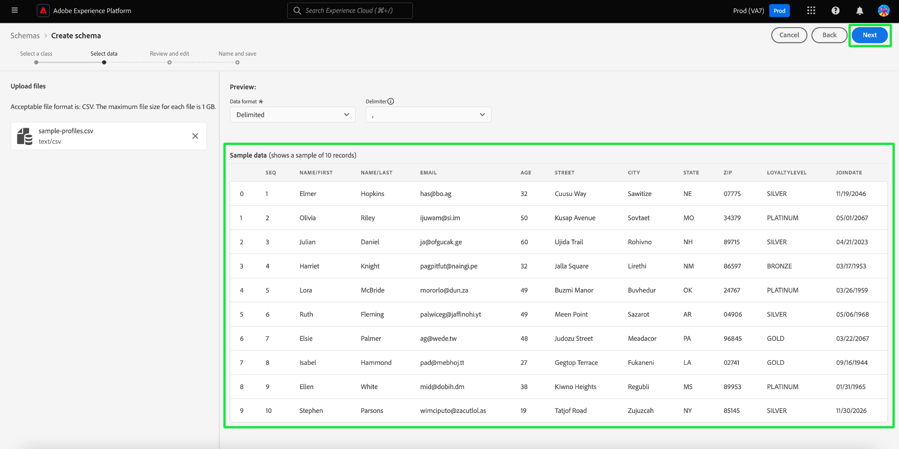

# 机器学习辅助模式创建

>[!AVAILABILITY]
>
>* 机器学习辅助模式创建当前处于Beta阶段。 文档和功能可能会发生变化。

使用ML算法从示例数据生成架构。 在为大型复杂数据集定义结构、字段和数据类型时，此过程可节省时间并提高准确性。

利用ML模式生成，您可以快速集成新数据源，并减少手动创建的错误。 非技术用户可以使用它来生成架构或管理大型复杂数据集，而无需任何额外的工作。 此帮助可加快从获取数据到获得洞察信息的过程，并使合并新数据源和执行数据分析变得更轻松。

## 快速入门

本教程需要对创建架构的要求有一定的了解。 在继续本指南之前，您应该阅读有关创建和编辑架构的[UI指南](./resources/schemas.md)。

本指南介绍如何使用机器学习(ML)算法创建架构，以从示例数据生成架构。 有关在架构编辑器中创建架构或有关基于[字段的工作流](https://experienceleague.adobe.com/zh-hans/docs/experience-platform/xdm/ui/field-based-workflows)的文档的信息，请参阅[手动架构创建工作流指南](https://experienceleague.adobe.com/zh-hans/docs/experience-platform/xdm/ui/resources/schemas#add-field-groups)，以加深您对架构创建过程的了解。

>[!NOTE]
>
>您还可以使用[!DNL Schema Registry] API编写架构。 要使用API手动创建架构，请先阅读[[!DNL Schema Registry] 开发人员指南](../api/getting-started.md)，然后再尝试阅读有关[使用API创建架构](../tutorials/create-schema-api.md)的教程。

## 导航到创建架构工作流 {#navigate-to-schema-creation-workflow}

从Experience Platform UI的左侧导航中，选择&#x200B;**[!UICONTROL 架构]**&#x200B;工作区。 出现&#x200B;**[!UICONTROL 架构]**&#x200B;工作区。 选择&#x200B;**[!UICONTROL 创建架构]**&#x200B;以添加新架构以启动架构创建工作流。

## 创建架构 {#create-a-schema}

出现[!UICONTROL 创建架构]对话框。 选择&#x200B;**[ML辅助]**&#x200B;架构创建选项，然后选择&#x200B;**[!UICONTROL 选择]**&#x200B;以确认您的选择。

![已突出显示[!UICONTROL ML — 辅助]的[!UICONTROL 创建架构]对话框。](../images/ui/ml-schema-creation/use-sample-csv.png)

### 选择基类 {#select-base-class}

出现[!UICONTROL 创建架构]工作流。 为您的架构选择一个基类，然后选择&#x200B;**[!UICONTROL 下一步]**。

### 上传 CSV 文件 {#upload-csv}

此时将显示创建工作流的&#x200B;**[!UICONTROL 选择数据]**&#x200B;阶段。 从&#x200B;**[!UICONTROL 上载文件]**&#x200B;部分，选择&#x200B;**[!UICONTROL 选择文件]**&#x200B;或&#x200B;**[!UICONTROL 拖放文件]**&#x200B;部分。 从您的计算机中选择一个.csv文件以生成架构。

### 预览数据 {#preview-data}

[!UICONTROL 上载文件]部分显示您导入的CSV文件的名称，**[!UICONTROL 预览]**&#x200B;部分显示您上载的文件中的示例数据行。 选择&#x200B;**[!UICONTROL 下一步]**&#x200B;以继续工作流。

### 查看和编辑架构 {#review-schema}

此时将显示创建工作流的&#x200B;**[!UICONTROL 查看和编辑]**&#x200B;阶段，该阶段在表格视图中显示机器学习辅助的&#x200B;**[!UICONTROL 架构推荐]**。 在此阶段，您可以从机器学习模型生成的推荐架构中编辑、添加或删除字段。 该表包含以下字段：

| 字段名称 | 描述 |
|------------------|---------------------------------------------------------|
| [!UICONTROL 数据表] | 字段所在的数据集或数据库。 |
| [!UICONTROL Source字段] | 源系统中的原始字段名称。 |
| [!UICONTROL 目标字段] | 数据将映射到的目标系统中的字段名称。 |
| [!UICONTROL 显示名称] | 用于在用户界面中显示字段的名称。 此名称应当更加便于用户使用或者更具描述性。 |
| [!UICONTROL 数据类型] | 存储在字段中的数据类型（例如，`String`，`Date`）。 |
| [!UICONTROL 字段组] | 基于字段使用或上下文的字段分类(例如，[!UICONTROL 人口统计详细信息]、[!UICONTROL Commerce详细信息])。 |

#### 添加字段 {#add-field}

若要向架构中添加字段，请选择&#x200B;**[!UICONTROL 添加新字段]**。

出现[!UICONTROL 选择字段]对话框。 该对话框包含当前存在的架构的图表。 选择所需的字段并选择&#x200B;**[选择]**&#x200B;以向架构中添加新字段。 选择&#x200B;**[取消]**&#x200B;关闭对话框（如果需要）。

推荐的架构上将显示一个新行。 您现在可以编辑该字段。

#### 编辑字段 {#edit-field}

要编辑字段，请选择要编辑的行的铅笔图标。 右侧将显示一个详细信息面板，您可以在其中编辑自定义字段映射。 详细信息面板包含[!UICONTROL 目标字段]、[!UICONTROL 显示名称]、[!UICONTROL 数据类型]和[!UICONTROL 字段组]。 进行任何必要的更改，然后选择&#x200B;**[!UICONTROL 应用]**&#x200B;进行确认。 再次选择铅笔图标以关闭详细信息面板。

#### 删除字段 {#remove-field}

要删除字段，请选择要删除的行上的减号图标。

>[!CAUTION]
>
>删除此项目时，不显示确认对话框。

#### 批准推荐的架构 {#approve}

要批准建议的架构并继续&#x200B;**[!UICONTROL 创建架构]**&#x200B;工作流，请选择&#x200B;**[下一步]**。

### 命名并保存架构 {#name-and-save}

此时将显示创建工作流的&#x200B;**[!UICONTROL Name和save]**&#x200B;阶段。 输入&#x200B;**[架构显示名称]**&#x200B;和可选描述。 **[生成的架构]**&#x200B;部分提供了ML生成的架构的图表。 选择&#x200B;**[完成]**&#x200B;以完成架构创建工作流。

### 在架构编辑器中查看 {#view-in-editor}

此时将显示架构编辑器，您新创建的架构将显示在画布中。 选择&#x200B;**[!UICONTROL 保存]**&#x200B;以返回[!UICONTROL 架构]工作区。

## 后续步骤

创建架构后，您可以使用架构编辑器进行进一步的修改（如有必要）。 您的新架构现在已准备好与数据源集成并用于数据分析。

有关使用架构编辑器的详细信息，请参阅[编辑现有架构指南](https://experienceleague.adobe.com/zh-hans/docs/experience-platform/xdm/ui/resources/schemas#edit)。
