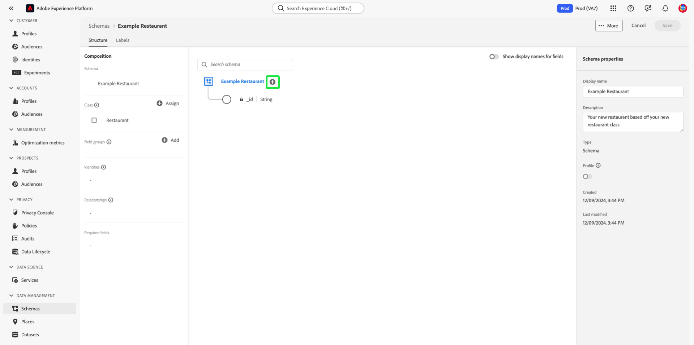

# 在UI中创建和编辑类

在体验数据模型(XDM)中，类定义模式将包含的数据的行为方面（记录或时间序列）。 除此之外，类还描述了所有基于该类的模式需要包含的最小公共属性数，并为合并多个兼容数据集提供了一种方法。

Adobe提供几个标准（“核心”）XDM类，包括[!DNL XDM Individual Profile]和[!DNL XDM ExperienceEvent]。 除了这些核心类之外，您还可以创建自己的自定义类，以描述组织的更具体用例。

此文档概述了如何在Adobe Experience PlatformUI中创建、编辑和管理自定义类。

## 先决条件

本指南要求对XDM系统有有效的了解。 有关XDM在Experience Platform生态系统中的角色的介绍，请参阅[XDM概述](../../home.md)，以及[模式合成基础知识](../../schema/composition.md)，了解类对XDM模式的贡献。

虽然本指南不是必需的，但建议您还要按照[在UI](../../tutorials/create-schema-ui.md)中编写模式的教程来熟悉[!DNL Schema Editor]的各种功能。

## 创建新类{#create}

在&#x200B;**[!UICONTROL 模式]**&#x200B;工作区中，选择&#x200B;**[!UICONTROL 创建模式]**，然后从下拉菜单中选择&#x200B;**[!UICONTROL 浏览]**。

将显示一个对话框，允许您从可用类的列表中进行选择。 在对话框顶部，选择&#x200B;**[!UICONTROL 新建类]**。 然后，您可以为新类提供一个显示名称（类的简短、描述性、唯一且用户友好的名称）、描述以及模式将定义的数据的行为（“[!UICONTROL Record]”或“[!UICONTROL Time-series]”）。

完成后，选择&#x200B;**[!UICONTROL 分配类]**。

将出现[!DNL Schema Editor]，在画布中显示基于您刚刚创建的自定义类的新模式。 由于尚未将任何字段添加到类中，因此该模式只包含一个`_id`字段，它表示系统生成的唯一标识符，该标识符将自动应用于[!DNL Schema Registry]中的所有资源。

>[!IMPORTANT]
>
>构建实现组织定义的类的模式时，请记住，混合仅可用于兼容类。 由于您定义的类是新类，因此在&#x200B;**[!UICONTROL 添加mixin]**&#x200B;对话框中没有列出兼容的混音。 相反，您需要[创建新的mixin](./mixins.md#create)以用于该类。 下次构建实现新类的模式时，将列出您定义的混音并可供使用。

您现在可以开始[向类](#add-fields)添加字段，该字段将由使用该类的所有模式共享。

## 编辑现有类{#edit}

>[!NOTE]
>
>只能编辑您的组织定义的自定义类。
>
>此外，在保存某个类并将其用于数据获取后，只能对其进行附加更改。 有关详细信息，请参阅[模式演化规则](../../schema/composition.md#evolution)。

要编辑现有类，请选择&#x200B;**[!UICONTROL 浏览]**&#x200B;选项卡，然后选择使用要编辑的类的模式的名称。

>[!TIP]
>
>您可以使用工作区的搜索和筛选功能来帮助更轻松地查找模式。 有关详细信息，请参见[探索XDM资源](../explore.md)的指南。

出现[!DNL Schema Editor]，画布中显示模式的结构。 您现在可以开始[向类](#add-fields)添加字段。

## 向类{#add-fields}添加字段

在[!UICONTROL 模式编辑器]中打开了使用自定义类的模式后，您可以开始向类添加字段。 要添加新字段，请选择模式名称旁的加号(+)**图标。**

>[!IMPORTANT]
>
>请记住，您添加到某个类的任何字段都将用于使用该类的所有模式。 因此，您应仔细考虑哪些字段在所有模式用例中都有用。 如果您正在考虑添加只能在此类下的某些模式中使用的字段，您可能想考虑通过[创建混音](./mixins.md#create)将其添加到这些模式。

画布中会显示&#x200B;**[!UICONTROL 新字段]**，右边栏会更新以显示用于配置字段属性的控件。 有关如何配置字段并将其添加到类的具体步骤，请参见UI](../fields/overview.md#define)中的[定义字段的指南。

继续向类添加所需数量的字段。 完成后，选择&#x200B;**[!UICONTROL 保存]**&#x200B;以保存模式和类。

如果您之前已创建使用此类的模式，则新添加的字段将自动显示在这些模式中。

## 更改模式{#schema}的类

在初始创建过程中，保存模式之前，可以随时更改该类。 有关详细信息，请参见[创建和编辑模式](./schemas.md#change-class)的指南。

## 后续步骤

此文档介绍了如何使用平台UI创建和编辑类。 有关[!UICONTROL 模式]工作区功能的详细信息，请参阅[[!UICONTROL 模式]工作区概述](../overview.md)。

要了解如何使用[!DNL Schema Registry] API管理类，请参阅[类端点指南](../../api/classes.md)。