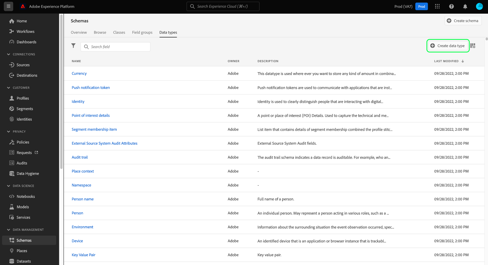

# 使用UI创建和编辑数据类型

在体验数据模型(XDM)中，数据类型与基本文本字段的使用方式相同地用作类或混合中的引用类型字段，关键区别在于数据类型可以定义多个子字段。 虽然与混音类似，它们允许多字段结构的一致使用，但数据类型更灵活，因为它们可以包含在模式结构中的任何位置，而混音只能添加在根级别。

Adobe Experience Platform提供许多标准数据类型，可用于涵盖各种常见体验管理用例。 但是，您也可以定义自己的自定义数据类型以满足您独特的业务需求。

本教程介绍在平台用户界面中创建和编辑自定义数据类型的步骤。

## 先决条件

本指南要求对XDM系统有有效的了解。 有关Experience Platform生态系统中XDM角色的介绍，请参阅[XDM概述](../../home.md)，以及[模式组合基础知识](../../schema/composition.md)，了解数据类型如何对XDM模式作出贡献。

虽然本指南不是必需的，但建议您还要按照[在UI](../../tutorials/create-schema-ui.md)中编写模式的教程来熟悉[!DNL Schema Editor]的各种功能。

## 打开[!DNL Schema Editor]数据类型

在平台UI中，在左侧导航中选择&#x200B;**[!UICONTROL 模式]**&#x200B;以打开[!UICONTROL 模式]工作区，然后选择&#x200B;**[!UICONTROL 数据类型]**&#x200B;选项卡。 将显示可用列表类型的Adobe，包括由定义的数据类型以及由您的组织创建的数据类型。

从此处，您有两个选择：

- [创建新数据类型](#create)
- [选择要编辑的现有数据类型](#edit)

### 创建新数据类型{#create}

从&#x200B;**[!UICONTROL 数据类型]**&#x200B;选项卡中，选择&#x200B;**[!UICONTROL 创建数据类型]**。

出现[!DNL Schema Editor]，显示画布中新数据类型的当前结构。 在编辑器的右侧，您可以为数据类型提供显示名称和可选说明。 确保为数据类型提供唯一且简明的名称，因为在将数据类型添加到模式时，将如何识别该数据类型。

本教程创建描述餐馆属性的数据类型，因此该数据类型的显示名称为“餐馆”。

从此处，您可以跳到[下一节](#add-fields),开始向新数据类型添加字段。

### 编辑现有数据类型

只能编辑您的组织定义的自定义数据类型。 要缩小显示的列表，请选择筛选器图标（），以根据[!UICONTROL 所有者]显示用于筛选的控件。 选择&#x200B;**[!UICONTROL Customer]**&#x200B;以仅显示您的组织拥有的自定义数据类型。

从列表中选择要编辑的数据类型以打开右边栏，其中显示数据类型的详细信息。 在右边栏中选择数据类型的名称，以在[!DNL Schema Editor]中打开其结构。

## 向数据类型{#add-fields}添加字段

要开始向数据类型添加字段，请选择画布中根级字段旁边的加号(+)**图标。**&#x200B;下面将显示一个新字段，右边栏将更新以显示新字段的控件。

使用右边栏中的控件配置新字段的详细信息。 有关如何配置字段并将其添加到数据类型的特定步骤，请参阅UI](../fields/overview.md#define)中的[定义字段的指南。

餐厅数据类型需要一个字符串字段来表示餐馆的名称。 因此，将[!UICONTROL 字段名称]设置为“name”，将[!UICONTROL 类型]设置为“[!UICONTROL 字符串]”。 选择&#x200B;**[!UICONTROL 应用]**&#x200B;以将更改应用到字段。

根据需要继续向数据类型添加更多字段。 “餐厅”数据类型示例现在为品牌、座位容量和楼面空间增加了字段。

除了基本字段之外，您还可以在自定义数据类型中嵌套其他数据类型。 例如，Restaurant数据类型需要一个表示属性物理地址的字段。 在此方案中，您可以添加新的“地址”字段，该字段已分配标准数据类型“[!UICONTROL 邮政地址]”。

这说明在描述数据时，数据类型的灵活性如何：数据类型可以使用字段，这些字段也是数据类型，它们本身可以包含更多数据类型，等等。 这使您能够在整个XDM模式中抽象和重复使用常见数据模式，从而更轻松地表示复杂的数据结构。

将字段添加完数据类型后，选择&#x200B;**[!UICONTROL 保存]**&#x200B;以保存更改并将数据类型添加到[!DNL Schema Library]。

## 将数据类型添加到类或混合

创建数据类型后，即可在模式中使用它。 由于XDM模式由类和零个或多个混音组成，因此不能直接将数据类型提供的字段添加到模式。 相反，它们必须包含在类或混音中。

开始，方法是按照将字段添加到类](./classes.md#add-fields)或[添加字段到mixin](./mixins.md#add-fields)中涉及的步骤。 [为新字段选择&#x200B;**[!UICONTROL 类型]**&#x200B;时，请从下拉菜单中选择数据类型的名称。

## 将多字段对象转换为数据类型{#convert}

在[!DNL Schema Editor]中创建具有多个子字段的对象类型字段时，可以将该字段转换为数据类型，以便在其他类或混合中使用相同的字段结构。

要将对象类型字段转换为数据类型，请在画布中选择该字段。 在转换字段之前，请确保&#x200B;**[!UICONTROL 显示名称]**&#x200B;对对象将包含的数据进行描述，因为这将成为数据类型的名称。 准备好转换字段时，请在右边栏中选择&#x200B;**[!UICONTROL 转换为新数据类型]**。

画布将字段的数据类型从“[!UICONTROL Object]”更新为新数据类型。 子字段旁边还有小的锁图标，表示它们不再是单个字段，而是多字段数据类型的一部分。 现在，在定义新字段时，从&#x200B;**[!UICONTROL 类型]**&#x200B;下拉菜单中选择此数据类型，即可在其他类和混合中重复使用此结构。

## 后续步骤

本指南介绍了如何使用平台UI创建和编辑数据类型。 有关[!UICONTROL 模式]工作区功能的详细信息，请参阅[[!UICONTROL 模式]工作区概述](../overview.md)。

要了解如何使用[!DNL Schema Registry] API管理数据类型，请参阅[数据类型终结点指南](../../api/data-types.md)。
