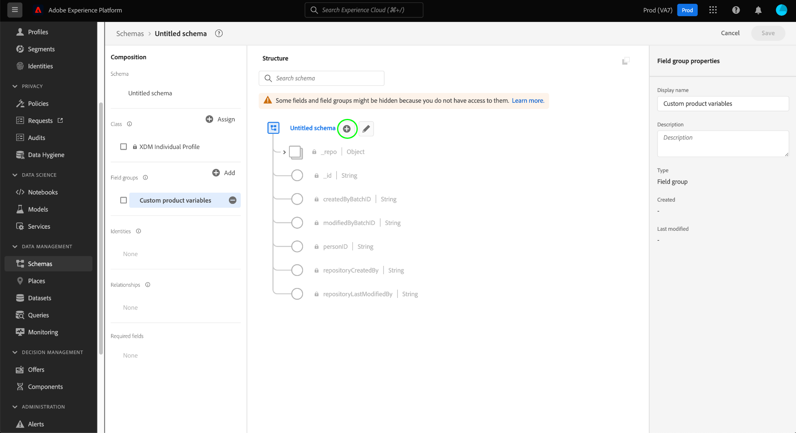

# 在UI中创建和编辑模式字段组

在体验模式模型(XDM)中，体验字段组是可重用的组件，可定义一个或多个字段，这些字段可实现某些功能，如个人详细信息、酒店首选项或地址。 字段组将作为实现兼容类的模式的一部分包含。

字段组根据字段组表示的数据（记录或时间序列）的行为定义其与哪些类兼容。 这意味着并非所有字段组都可用于所有类。

Adobe Experience Platform提供许多标准字段组，涵盖各种营销用例。 但是，您也可以创建和编辑您自己的自定义字段组，以在XDM模式中定义与您的业务相关的其他概念。 本指南概述了如何在平台UI中为您的组织创建、编辑和管理自定义字段组。

## 先决条件

本指南要求对XDM系统有充分的了解。 有关XDM在Experience Platform生态系统中的作用的介绍，请参阅[XDM概述](../../home.md)，以及[模式合成基础知识](../../schema/composition.md)，了解字段组对XDM模式的贡献。

虽然本指南不是必需的，但建议您也要按照有关在UI](../../tutorials/create-schema-ui.md)中编写模式的教程来熟悉[!DNL Schema Editor]的各种功能。[

## 创建新字段组{#create}

要创建新字段组，必须首先选择要将字段组添加到的模式。 您可以选择[创建新模式](./schemas.md#create)或[选择现有模式以编辑](./schemas.md#edit)。

在[!DNL Schema Editor]中打开模式后，请选择左边栏中[!UICONTROL Field groups]部分旁边的&#x200B;**[!UICONTROL Add]**。

将显示一个对话框，其中显示您组织的现有字段组的列表。 在对话框顶部附近，选择&#x200B;**[!UICONTROL Create new field group]**。 在此，您可以为字段组提供&#x200B;**[!UICONTROL Display name]**&#x200B;和&#x200B;**[!UICONTROL Description]**。 完成后，选择&#x200B;**[!UICONTROL Add field group]**。

将重新显示[!DNL Schema Editor]，新字段组列在左边栏中。 由于这是一个全新的字段组，因此它当前不向模式提供任何字段，因此画布保持不变。 您现在可以开始[向字段组](#add-fields)添加字段。

## 编辑现有字段组{#edit}

>[!NOTE]
>
>只能完全编辑和自定义您的组织定义的自定义字段组。 对于由Adobe定义的核心字段组，只能在单个模式的上下文中编辑其字段的显示名称。 有关详细信息，请参阅[编辑模式字段的显示名称部分](./schemas.md#display-names)。
>
>在保存自定义字段组并将其用于模式以获取数据后，只能对字段组进行附加更改。 有关详细信息，请参阅[模式演化规则](../../schema/composition.md#evolution)。

要编辑现有字段组，必须首先打开一个模式，它使用[!DNL Schema Editor]中的字段组。 您可以[选择要编辑的现有模式](./schemas.md#edit)，也可以[创建新模式](./schemas.md#create)并添加相关字段组。

在编辑器中打开模式后，可以开始[向字段组](#add-fields)添加字段。

## 将字段添加到字段组{#add-fields}

要向[!DNL Schema Editor]中的字段组添加字段，请在左边栏中选择字段组的名称，然后在画布中选择开始名称旁的&#x200B;**加号(+)**&#x200B;图标。

画布中会显示&#x200B;**[!UICONTROL New field]**，右边栏会更新，显示用于配置字段属性的控件。 有关如何配置字段并将其添加到字段组的具体步骤，请参阅UI](../fields/overview.md#define)中[定义字段的指南。

继续向字段组添加所需数量的字段。 完成后，选择&#x200B;**[!UICONTROL Save]**&#x200B;以保存模式和字段组。

如果同一字段组已在其他模式中使用，则新添加的字段将自动显示在这些模式中。

## 后续步骤

本指南介绍了如何使用平台UI创建和编辑字段组。 有关[!UICONTROL Schemas]工作区功能的详细信息，请参阅[[!UICONTROL Schemas]工作区概述](../overview.md)。

要了解如何使用[!DNL Schema Registry] API管理字段组，请参阅[字段组终结点指南](../../api/field-groups.md)。