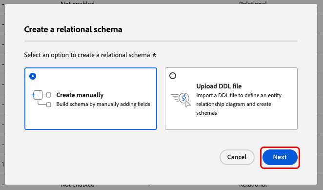
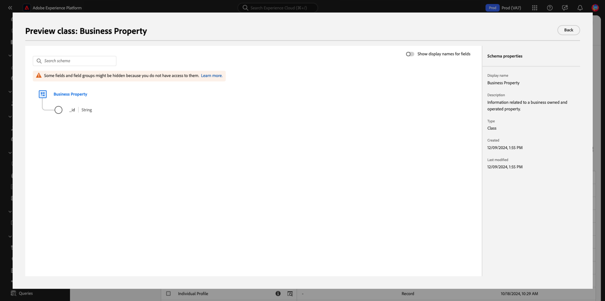
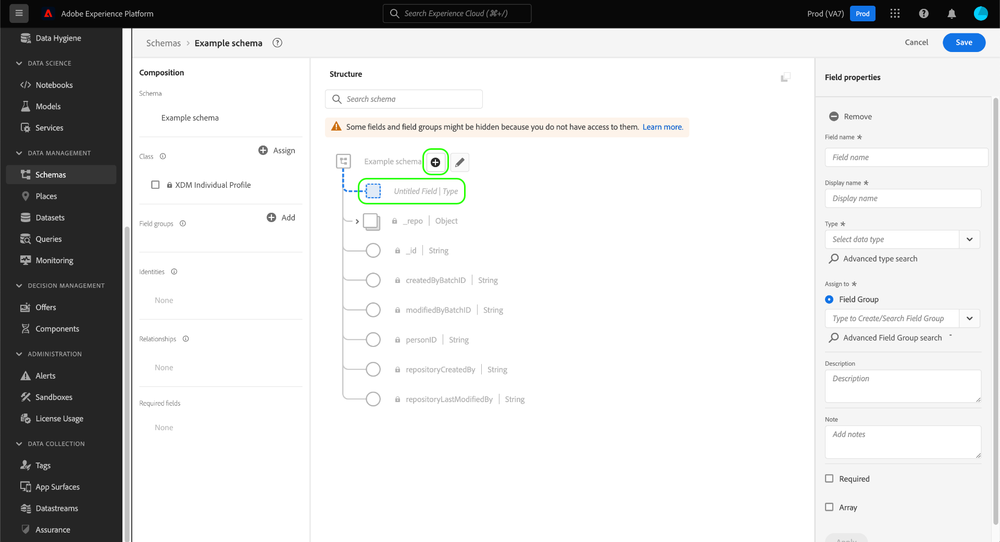

# 在 UI 中创建和编辑架构 {#create-edit-schemas-in-ui}

本指南概述了如何在Adobe Experience Platform UI中为您的组织创建、编辑和管理Experience Data Model (XDM)架构。

>[!IMPORTANT]
>
>XDM架构极具可自定义性，因此，创建架构所涉及的步骤可能会因您希望架构捕获的数据类型而异。 因此，本文档仅介绍您可以在UI中使用架构进行的基本交互，并排除自定义类、架构字段组、数据类型和字段等相关步骤。
>
>有关架构创建过程的完整导览，请随[架构创建教程](../../tutorials/create-schema-ui.md)一起创建完整的示例架构并熟悉[!DNL Schema Editor]的多种功能。

## 先决条件 {#prerequisites}

本指南要求您对XDM系统有一定的了解。 请参阅[XDM概述](../../home.md)，了解XDM在Experience Platform生态系统中的角色简介，并参阅[架构组合基础知识](../../schema/composition.md)，了解架构的构建方式。

## 创建新架构 {#create}

在[!UICONTROL Schemas]工作区中，选择右上角的&#x200B;**[!UICONTROL Create schema]**。 将显示“选择架构类型”下拉菜单，其中包含[!UICONTROL Standard]或[!UICONTROL Relational]架构的选项。

![突出显示具有[!UICONTROL Create Schema]的架构工作区，并显示“选择架构类型”下拉列表](../../images/ui/resources/schemas/create-schema.png)。

## 创建关系架构 {#create-relational-schema}

>[!AVAILABILITY]
>
>Data Mirror和关系架构可供Adobe Journey Optimizer **协调的营销活动**&#x200B;许可证持有人使用。 根据您的许可证和功能启用，它们也可用作Customer Journey Analytics用户的&#x200B;**有限版本**。 请联系您的Adobe代表以获取访问权限。

选择&#x200B;**[!UICONTROL Relational]**&#x200B;以定义对记录具有细粒度控制的结构化关系样式架构。 关系架构通过主键和外键支持主键强制、记录级版本控制和架构级关系。 它们还针对使用变更数据捕获的增量摄取进行了优化，并支持在Campaign Orchestration、Data Distiller和B2B实施中使用的多个数据模型。

若要了解更多信息，请参阅[Data Mirror](../../data-mirror/overview.md)或[关系架构](../../schema/relational.md)概述。

### 手动创建 {#create-manually}

>[!AVAILABILITY]
>
>DDL文件上传仅适用于Adobe Journey Optimizer Orchestrated促销活动许可证持有者。 您的UI可能显示方式不同。

出现&#x200B;**[!UICONTROL Create a relational schema]**&#x200B;对话框。 您可以选择&#x200B;**[!UICONTROL Create manually]**&#x200B;或[**[!UICONTROL Upload DDL file]**](#upload-ddl-file)来定义架构结构。

在&#x200B;**[!UICONTROL Create a relational schema]**&#x200B;对话框中，选择&#x200B;**[!UICONTROL Create manually]**，然后选择&#x200B;**[!UICONTROL Next]**。

此时会显示&#x200B;**[!UICONTROL Relational schema details]**&#x200B;页面。 输入架构显示名称和可选描述，然后选择&#x200B;**[!UICONTROL Finish]**&#x200B;以创建架构。

![突出显示了[!UICONTROL Schema display name]、[!UICONTROL Description]和[!UICONTROL Finish]的关系架构详细信息视图。](../../images/ui/resources/schemas/relational-details.png)

架构编辑器将打开，并带有用于定义架构结构的空画布。 您可以像往常一样添加字段。

#### 添加版本标识符字段 {#add-version-identifier}

要启用版本跟踪并支持变更数据捕获，必须在架构中指定一个版本标识符字段。 在架构编辑器中，选择加号()图标以添加新字段。

输入字段名称，如`updateSequence`，然后选择&#x200B;**[!UICONTROL DateTime]**&#x200B;或&#x200B;**[!UICONTROL Number]**&#x200B;数据类型。

在右边栏中，启用&#x200B;**[!UICONTROL Version Identifier]**&#x200B;复选框，然后选择&#x200B;**[!UICONTROL Apply]**&#x200B;以确认该字段。

>[!IMPORTANT]
>
>关系架构必须包含版本标识符字段，以支持记录级更新和变更数据捕获引入。

要定义关系，请在架构编辑器中选择&#x200B;**[!UICONTROL Add Relationship]**&#x200B;以创建架构级别的主键/外键关系。 有关详细信息，请参阅有关[添加架构级别关系](../../tutorials/relationship-ui.md#relationship-field)的教程。

接下来，继续[定义主键](../fields/identity.md#define-a-identity-field)，并根据需要[添加其他字段](#add-field-groups)。 有关如何在Experience Platform源中启用变更数据捕获的指导，请参阅[变更数据捕获引入指南](../../../sources/tutorials/api/change-data-capture.md)。

>[!NOTE]
>
>保存后，[!UICONTROL Type]侧边栏中的[!UICONTROL  Schema properties]字段指示这是[!UICONTROL Relational]架构。 架构库存视图的详细信息侧边栏中也指出了这一点。
>

### 上载DDL文件 {#upload-ddl-file}

>[!AVAILABILITY]
>
>DDL文件上传仅适用于Adobe Journey Optimizer Orchestrated促销活动许可证持有者。

使用此工作流通过上传DDL文件来定义架构。 在&#x200B;**[!UICONTROL Create a relational schema]**&#x200B;对话框中，选择&#x200B;**[!UICONTROL Upload DDL file]**，然后从系统中拖动本地DDL文件或选择&#x200B;**[!UICONTROL Choose files]**。 Experience Platform验证架构，如果文件上传成功，则显示绿色复选标记。 选择&#x200B;**[!UICONTROL Next]**&#x200B;以确认上传。

![已选择[!UICONTROL Upload DDL file]并突出显示[!UICONTROL Next]的“创建关系架构”对话框。](../../images/ui/resources/schemas/upload-ddl-file.png)

将显示[!UICONTROL Select entities and fields to import]对话框，允许您预览架构。 查看架构结构，并使用单选按钮和复选框确保每个实体都指定了主键和版本标识符。

>[!IMPORTANT]
>
>表结构必须包含&#x200B;**主键**&#x200B;和&#x200B;**版本标识符**，例如datetime或数字类型的`updateSequence`字段。
>
>对于变更数据捕获摄取，还需要名为`_change_request_type`且类型为String的特殊列才能启用增量处理。 此字段指示数据更改的类型(例如，`u` (upsert)或`d` (delete))。

虽然在引入期间需要，但诸如`_change_request_type`之类的控件列未存储在架构中，并且未出现在最终架构结构中。 如果一切看起来都正确，请选择&#x200B;**[!UICONTROL Done]**&#x200B;以创建架构。

>[!NOTE]
>
>DDL上载支持的最大文件大小为10MB。

![显示导入字段并突出显示[!UICONTROL Finish]的关系架构审核视图。](../../images/ui/resources/schemas/entities-and-files-to-inport.png)

架构将在架构编辑器中打开，您可以在保存之前调整结构。

接下来，继续[添加其他字段](#add-field-groups)，并根据需要[添加其他架构级别关系](../../tutorials/relationship-ui.md#relationship-field)。

有关如何在Experience Platform源中启用变更数据捕获的指导，请参阅[变更数据捕获引入指南](../../../sources/tutorials/api/change-data-capture.md)。

## 标准架构创建 {#standard-based-creation}

如果从“选择架构类型”下拉菜单中选择“标准架构类型”，则会显示[!UICONTROL Create a schema]对话框。 在此对话框中，您可以选择通过添加字段和字段组手动创建架构，也可以上传CSV文件并使用ML算法生成架构。 从对话框中选择架构创建工作流。

### [!BADGE Beta]{type=Informative}手动或ML辅助模式创建 {#manual-or-assisted}

要了解如何使用ML算法推荐基于csv文件的架构结构，请参阅[机器学习辅助架构创建指南](../ml-assisted-schema-creation.md)。 本UI指南重点介绍手动创建工作流。

### 手动创建模式 {#manual-creation}

出现[!UICONTROL Create schema]工作流。 您可以通过选择&#x200B;**[!UICONTROL Individual Profile]**、**[!UICONTROL Experience Event]**&#x200B;或&#x200B;**[!UICONTROL Other]**&#x200B;为架构选择基类，然后选择&#x200B;**[!UICONTROL Next]**&#x200B;以确认您的选择。 有关这些类的详细信息，请参阅[[!UICONTROL XDM individual profile]](../../classes/individual-profile.md)和[[!UICONTROL XDM ExperienceEvent]](../../classes/experienceevent.md)文档。

![突出显示具有三个类选项和[!UICONTROL Create schema]的[!UICONTROL Next]工作流。](../../images/ui/resources/schemas/schema-class-options.png)

选择&#x200B;**[!UICONTROL Other]**&#x200B;时，将显示可用类的列表。 在此处，您可以浏览和过滤预先存在的类。

![在[!UICONTROL Create schema]部分中高亮显示具有[!UICONTROL Other]的[!UICONTROL Schema details]工作流。](../../images/ui/resources/schemas/other-schema-details.png)

选择一个单选按钮，以根据类是自定义类还是标准类来筛选这些类。 您还可以根据行业筛选可用的结果，或使用搜索字段搜索特定类。

![带有搜索栏[!UICONTROL Create schema]和[!UICONTROL Custom]的[!UICONTROL Industries]工作流已突出显示。](../../images/ui/resources/schemas/filter-and-search.png)

为了帮助您确定相应的类，每个类都有信息和预览图标。 信息图标()打开一个对话框，其中提供了类及其关联的行业的说明。

预览图标()打开包含架构图及其属性的类的预览对话框。

选择任意行以选择一个类，然后选择&#x200B;**[!UICONTROL Next]**&#x200B;以确认您的选择。

![具有从可用类表中选择的类且突出显示[!UICONTROL Create schema]的[!UICONTROL Next]工作流。](../../images/ui/resources/schemas/select-class.png)

选择类后，将显示[!UICONTROL Name and review]部分。 在此部分中，您会提供用于标识架构的名称和描述。&#x200B;AEM架构的基本结构（由类提供）显示在画布中，供您查看和验证选定的类和架构结构。

在文本字段中输入人性化的[!UICONTROL Schema display name]。 接下来，输入适当的描述以帮助识别您的架构。 当您查看了架构结构并对设置感到满意时，请选择&#x200B;**[!UICONTROL Finish]**&#x200B;以创建您的架构。

![突出显示了[!UICONTROL Name and review]、[!UICONTROL Create schema]和[!UICONTROL Schema display name]的[!UICONTROL Description]工作流的[!UICONTROL Finish]部分。](../../images/ui/resources/schemas/name-and-review.png)

此时将显示架构编辑器，其中架构的结构显示在画布中。 如果需要，您现在可以开始[向类](../../ui/resources/classes.md#add-fields)添加字段。

## 编辑现有架构 {#edit}

>[!NOTE]
>
>一旦架构被保存并用于数据摄取，则只能对其执行额外的更改。 有关详细信息，请参阅架构演变[规则](../../schema/composition.md#evolution)。

要编辑现有架构，请选择&#x200B;**[!UICONTROL Browse]**&#x200B;选项卡，然后选择要编辑的架构的名称。 您还可以使用搜索栏缩小可用选项列表的范围。

>[!TIP]
>
>您可以使用工作区的搜索和筛选功能来帮助更轻松地查找架构。 有关详细信息，请参阅[浏览XDM资源](../explore.md)指南。

选择架构后，[!DNL Schema Editor]即会显示，画布中显示架构的结构。 您现在可以[将字段组](#add-field-groups)添加到架构中（或[添加这些组中的单个字段](#add-individual-fields)）、[编辑字段显示名称](#display-names)或[编辑现有的自定义字段组](./field-groups.md#edit)（如果架构使用了任何组）。

## 更多操作 {#more}

在架构编辑器中，您还可以执行快速操作以复制架构的JSON结构，或者删除架构（如果尚未为实时客户配置文件启用）或者具有关联的数据集。 选择视图顶部的[!UICONTROL More]以显示包含快速操作的下拉列表。

复制JSON结构功能允许您查看在仍在构建架构和数据管道时样本有效负载的外观。 对于模式中存在复杂的对象映射结构（如标识映射）的情况，此变量特别有用。

## 显示名称切换 {#display-name-toggle}

为方便起见，架构编辑器在原始字段名称和更易于用户识别的显示名称之间提供了切换开关。 这种灵活性可提高字段可发现性和架构的编辑。 此切换开关位于架构编辑器视图的右上角。

>[!NOTE]
>
>从字段名称到显示名称的更改纯粹是修饰性的，不会更改任何下游资源。

![已突出显示[!UICONTROL Show display names for fields]的架构编辑器。](../../images/ui/resources/schemas/display-name-toggle.png)

标准字段组的显示名称由系统生成，但可以自定义，如[显示名称](#display-names)部分中所述。 显示名称会反映在多个UI视图中，包括映射和数据集预览。 默认设置为off，并按其原始值显示字段名。

## 将字段组添加到架构 {#add-field-groups}

>[!NOTE]
>
>本节介绍如何将现有字段组添加到架构。 如果要创建新的自定义字段组，请改为参阅[创建和编辑字段组](./field-groups.md#create)指南。

在[!DNL Schema Editor]中打开架构后，可通过使用字段组向架构添加字段。 要开始，请选择左边栏中&#x200B;**[!UICONTROL Add]**&#x200B;旁边的&#x200B;**[!UICONTROL Field groups]**。

![高亮显示了[!UICONTROL Add]分区中带有[!UICONTROL Field groups]的架构编辑器。](../../images/ui/resources/schemas/add-field-group-button.png)

此时将显示一个对话框，其中显示了可为架构选择的字段组的列表。 由于字段组仅与一个类兼容，因此将仅列出与架构的选定类关联的字段组。 默认情况下，列出的字段组将根据其在您组织内的使用流行程度排序。

![突出显示了[!UICONTROL Add field groups]列的[!UICONTROL Popularity]对话框。](../../images/ui/resources/schemas/field-group-popularity.png)

如果您知道要添加字段的常规活动或业务领域，请在左边栏中选择一个或多个垂直行业的类别，以筛选显示的字段组列表。

![使用[!UICONTROL Add field groups]筛选器高亮显示[!UICONTROL Industry]对话框，并高亮显示[!UICONTROL Industry]列。](../../images/ui/resources/schemas/industry-filter.png)

>[!NOTE]
>
>有关XDM中特定于行业的数据建模的最佳实践的更多信息，请参阅有关[行业数据模型](../../schema/industries/overview.md)的文档。

您还可以使用搜索栏帮助查找所需的字段组。 名称与查询匹配的字段组显示在列表顶部。 在&#x200B;**[!UICONTROL Standard Fields]**&#x200B;下，将显示包含描述所需数据属性的字段的字段组。

![突出显示具有[!UICONTROL Add field groups]搜索功能的[!UICONTROL Standard fields]对话框。](../../images/ui/resources/schemas/field-group-search.png)

选中要添加到架构的字段组名称旁边的复选框。 您可以从列表中选择多个字段组，每个选定的字段组都显示在右边栏中。

![选中了复选框选择功能的[!UICONTROL Add field groups]对话框。](../../images/ui/resources/schemas/add-field-group.png)

>[!TIP]
>
>对于任何列出的字段组，您可以将光标悬停在信息图标（）上或集中在该图标上，以查看字段组捕获的数据类型的简短说明。 您还可以选择预览图标（）以查看字段组提供的字段结构，然后再决定将其添加到架构中。

选择字段组后，选择&#x200B;**[!UICONTROL Add field groups]**&#x200B;以将其添加到架构中。

![已选择字段组并突出显示[!UICONTROL Add field groups]的[!UICONTROL Add field groups]对话框。](../../images/ui/resources/schemas/add-field-group-finish.png)

[!DNL Schema Editor]重新出现，画布中显示了字段组提供的字段。

![显示具有示例架构的[!DNL Schema Editor]。](../../images/ui/resources/schemas/field-groups-added.png)

>[!NOTE]
>
>在架构编辑器中，标准(Adobe生成的)类和字段组以挂锁图标的问题。挂锁显示在左边栏中的类或字段组名称旁边，以及架构图中作为系统生成资源一部分的任意字段旁边。
>
>

将字段组添加到架构后，您可以选择根据您的需要[删除现有字段](#remove-fields)或[将新的自定义字段](#add-fields)添加到这些组。

### 移除从字段组添加的字段 {#remove-fields}

将字段组添加到架构后，您可以从字段组全局删除字段，或从当前架构本地隐藏它们。 了解这些操作之间的区别对于避免意外模式更改至关重要。

>[!IMPORTANT]
>
>选择&#x200B;**[!UICONTROL Remove]**&#x200B;将从字段组本身中删除该字段，这将影响使用该字段组的&#x200B;*所有*架构。
>除非您想要&#x200B;**从包含字段组**&#x200B;的每个架构中删除该字段，否则请不要使用此选项。

要从字段组中删除字段，请在画布中选择该字段，然后在右边栏中选择&#x200B;**[!UICONTROL Remove]**。 此示例显示`taxId`组中的&#x200B;**[!UICONTROL Demographic Details]**&#x200B;字段。

![突出显示了[!DNL Schema Editor]的[!UICONTROL Remove]。 此操作删除单个字段。](../../images/ui/resources/schemas/remove-single-field.png)

要从架构中隐藏多个字段而不从字段组本身中删除它们，请使用&#x200B;**[!UICONTROL Manage related fields]**&#x200B;选项。 从画布中的组中选择任意字段，然后在右边栏中选择&#x200B;**[!UICONTROL Manage related fields]**。

![高亮显示了[!DNL Schema Editor]的[!UICONTROL Manage related fields]。](../../images/ui/resources/schemas/manage-related-fields.png)

将出现一个对话框，显示字段组的结构。 使用复选框选择或取消选择要包含的字段。

![选定字段并突出显示[!UICONTROL Manage related fields]的[!UICONTROL Confirm]对话框。](../../images/ui/resources/schemas/select-fields.png)

选择&#x200B;**[!UICONTROL Confirm]**&#x200B;以更新画布并反映您选择的字段。

已添加

### 删除或弃用字段时的字段行为 {#field-removal-deprecation-behavior}

使用下表了解每个操作的范围。

| 操作 | 仅适用于当前架构 | 修改字段组 | 影响其他架构 | 描述 |
|--------------------------|--------------------------------|----------------------|-----------------------|-------------|
| **删除字段** | 否 | 是 | 是 | 从字段组中删除字段。 这会将其从使用该组的所有架构中删除。 |
| **管理相关字段** | 是 | 否 | 否 | 仅隐藏当前架构中的字段。 字段组保持不变。 |
| **弃用字段** | 否 | 是 | 是 | 在字段组中将该字段标记为已弃用。 它不再可用于任何架构。 |

>[!NOTE]
>
>在基于记录和基于事件的架构中，这种行为都是一致的。

### 将自定义字段添加到字段组 {#add-fields}

将字段组添加到架构后，您可以为该组定义其他字段。 但是，在一个架构中添加到字段组的任何字段也将出现在使用该字段组的所有其他架构中。

此外，如果将自定义字段添加到标准字段组，则该字段组将转换为自定义字段组，并且原始标准字段组将不再可用。

如果要将自定义字段添加到标准字段组，请参阅下面的[部分](#custom-fields-for-standard-groups)以了解具体说明。 如果要向自定义字段组添加字段，请参阅字段组UI指南中[编辑自定义字段组](./field-groups.md)的部分。

如果不想更改任何现有的字段组，您可以[创建新的自定义字段组](./field-groups.md#create)来定义其他字段。

## 将单个字段添加到架构 {#add-individual-fields}

如果要避免为特定用例添加整个字段组，可使用架构编辑器将单个字段直接添加到架构。 您可以[添加来自标准字段组的单个字段](#add-standard-fields)或[添加您自己的自定义字段](#add-custom-fields)。

>[!IMPORTANT]
>
>尽管架构编辑器在功能上允许您直接将单个字段添加到架构，但这不会更改XDM架构中的所有字段必须由其类或与该类兼容的字段组提供的事实。 如以下各节所述，作为添加到架构的关键步骤，所有单个字段仍与类或字段组关联。

### 添加标准字段 {#add-standard-fields}

您可以将标准字段组中的字段直接添加到架构中，而无需预先知道其对应的字段组。 要将标准字段添加到架构，请在画布中选择架构名称旁边的加号(**+**)图标。 架构结构中显示&#x200B;**[!UICONTROL Untitled Field]**&#x200B;占位符，右边栏更新以显示用于配置字段的控件。

在&#x200B;**[!UICONTROL Field name]**&#x200B;下，开始键入要添加的字段的名称。 系统自动搜索与查询匹配的标准字段，并在&#x200B;**[!UICONTROL Recommended Standard Fields]**&#x200B;下列出它们，包括它们所属的字段组。

虽然某些标准字段具有相同的名称，但它们的结构可能会因它们来自的字段组而异。 如果标准字段嵌套在字段组结构的父对象中，则添加子字段时，该父字段也将包含在架构中。

选择标准字段旁边的预览图标（）可查看其字段组的结构，并更好地了解其嵌套方式。 要将标准字段添加到架构，请选择加号图标（）。

画布将更新以显示添加到架构的标准字段，包括嵌套在字段组结构下的任何父字段。 字段组的名称也列在左边栏的&#x200B;**[!UICONTROL Field groups]**&#x200B;下。 如果要从同一字段组添加更多字段，请选择右边栏中的&#x200B;**[!UICONTROL Manage related fields]**。

已添加

### 添加自定义字段 {#add-custom-fields}

与标准字段的工作流类似，您还可以将自己的自定义字段直接添加到架构。

要将字段添加到架构的根级别，请在画布中选择架构名称旁边的加号(**+**)图标。 架构结构中显示&#x200B;**[!UICONTROL Untitled Field]**&#x200B;占位符，右边栏更新以显示用于配置字段的控件。

开始键入要添加的字段的名称，系统会自动开始搜索匹配的标准字段。 要创建新的自定义字段，请选择附加了&#x200B;**([!UICONTROL New Field])**&#x200B;的顶部选项。

在为该字段提供显示名称和数据类型后，下一步是将该字段分配给父XDM资源。 如果您的架构使用自定义类，则可以选择[将该字段添加到分配的类](#add-to-class)或[字段组](#add-to-field-group)。 但是，如果您的架构使用标准类，则只能将自定义字段分配给字段组。

#### 将字段分配给自定义字段组 {#add-to-field-group}

>[!NOTE]
>
>本节仅介绍如何将字段分配给自定义字段组。 如果要改用新的自定义字段扩展标准字段组，请参阅[将自定义字段添加到标准字段组](#custom-fields-for-standard-groups)一节。

在&#x200B;**[!UICONTROL Assign to]**&#x200B;下，选择&#x200B;**[!UICONTROL Field Group]**。 如果您的架构使用标准类，则这是唯一可用的选项，默认情况下处于选中状态。

接下来，必须为要关联的新字段选择字段组。 在提供的文本输入中开始键入字段组的名称。 如果您有任何与输入匹配的现有自定义字段组，则它们将显示在下拉列表中。 或者，您可以键入唯一名称来创建新的字段组。

>[!WARNING]
>
>如果选择现有的自定义字段组，则采用该字段组的任何其他架构在保存更改后也将继承新添加的字段。 因此，如果您希望进行这种类型的传播，请仅选择现有的字段组。 否则，您应该选择创建新的自定义字段组。

从列表中选择字段组后，选择&#x200B;**[!UICONTROL Apply]**。

新字段已添加到画布中，并且已在您的[租户ID](../../api/getting-started.md#know-your-tenant_id)下命名，以避免与标准XDM字段冲突。 与新字段关联的字段组也显示在左边栏中的&#x200B;**[!UICONTROL Field groups]**&#x200B;下。

>[!NOTE]
>
>默认情况下，所选自定义字段组提供的其余字段将从架构中删除。 如果要将其中一些字段添加到架构，请选择属于该组的字段，然后在右边栏中选择&#x200B;**[!UICONTROL Manage related fields]**。

#### 将字段分配给自定义类 {#add-to-class}

在&#x200B;**[!UICONTROL Assign to]**&#x200B;下，选择&#x200B;**[!UICONTROL Class]**。 下面的输入字段被替换成当前架构的自定义类的名称，这表示新字段将被分配给此类。

![正在为新字段分配选择[!UICONTROL Class]选项。](../../images/ui/resources/schemas/assign-field-to-class.png)

继续根据需要配置该字段，并在完成后选择&#x200B;**[!UICONTROL Apply]**。

正在为新字段选择![[!UICONTROL Apply]。](../../images/ui/resources/schemas/assign-field-to-class-apply.png)

新字段已添加到画布中，并且已在您的[租户ID](../../api/getting-started.md#know-your-tenant_id)下命名，以避免与标准XDM字段冲突。 在左边栏中选择类名称会显示作为类结构一部分的新字段。

### 向标准字段组的结构中添加自定义字段 {#custom-fields-for-standard-groups}

如果您正在处理的架构具有由标准字段组提供的对象类型字段，则可以将自己的自定义字段添加到该标准对象。

>[!WARNING]
>
>在一个架构中添加到字段组的任何字段也将出现在使用该字段组的所有其他架构中。 此外，如果将自定义字段添加到标准字段组，则该字段组将转换为自定义字段组，并且原始标准字段组将不再可用。
>
>如果您参加了此功能的Beta版，您将看到一个对话框，告知您之前自定义的标准字段组。 选择&#x200B;**[!UICONTROL Acknowledge]**&#x200B;后，列出的资源将转换为自定义字段组。
>
>

要开始，请选择标准字段组提供的对象根旁边的加号(**+**)图标。

出现警告消息，提示您确认是否要转换标准字段组。 选择&#x200B;**[!UICONTROL Continue creating field group]**&#x200B;以继续。

画布会重新显示，新字段的占位符无标题。 请注意，标准字段组的名称已附加“([!UICONTROL Extended])”，以表示已从原始版本修改了该名称。 从此处，使用右边栏中的控件来定义字段的属性。

应用更改后，新字段将显示在标准对象内的租户ID命名空间下。 此嵌套命名空间可防止字段组自身内的字段名称冲突，以避免破坏使用同一字段组的其他架构中的更改。

## 为实时客户轮廓启用架构 {#profile}

>[!CONTEXTUALHELP]
>id="platform_schemas_enableforprofile"
>title="为轮廓启用架构"
>abstract="在为轮廓启用一个架构时，从该架构创建的任何数据集都会参与实时客户轮廓，此轮廓合并来自不同源的数据以构建每个客户的完整视图。使用架构将数据提取到轮廓中后，无法将其禁用。有关更多信息，请参阅文档。"

[实时客户档案](../../../profile/home.md)合并来自不同来源的数据，以构建每个客户的完整视图。 如果希望架构捕获的数据参与此过程，则必须启用架构以便在[!DNL Profile]中使用。

>[!IMPORTANT]
>
>为了为[!DNL Profile]启用架构，它必须定义主标识字段。 有关详细信息，请参阅[定义标识字段](../fields/identity.md)指南。

要启用架构，请先在左边栏中选择架构的名称，然后在右边栏中选择&#x200B;**[!UICONTROL Profile]**&#x200B;切换开关。

此时会出现一个弹出窗口，警告您一旦启用并保存架构，就无法禁用该架构。 选择&#x200B;**[!UICONTROL Enable]**&#x200B;以继续。

在启用[!UICONTROL Profile]切换的情况下，画布将重新显示。

>[!IMPORTANT]
>
>由于架构尚未保存，如果您改变主意，让架构参与Real-time Customer Profile，则无法返回此值：保存启用的架构后，无法再禁用它。 再次选择&#x200B;**[!UICONTROL Profile]**&#x200B;切换可禁用架构。

要完成该过程，请选择&#x200B;**[!UICONTROL Save]**&#x200B;以保存架构。

该架构现已启用以用于Real-time Customer Profile。 当Experience Platform将数据摄取到基于此架构的数据集时，该数据将合并到您的合并用户档案数据中。

## 编辑架构字段的显示名称 {#display-names}

分配类并将字段组添加到架构后，可以编辑架构中任何字段的显示名称，无论这些字段是由标准资源还是自定义XDM资源提供。

>[!NOTE]
>
>请记住，属于标准类或字段组的字段的显示名称只能在特定架构的上下文中编辑。 换句话说，在一个架构中更改标准字段的显示名称不会影响使用相同关联类或字段组的其他架构。
>
>更改架构字段的显示名称后，这些更改将立即反映在基于该架构的任何现有数据集中。

通过在&#x200B;**[!UICONTROL Show display names for fields]**&#x200B;上切换，将字段名称更改为显示名称。 要编辑架构字段的显示名称，请在画布中选择该字段。 在右边栏中，在&#x200B;**[!UICONTROL Display name]**&#x200B;下提供新名称。

在右边栏中选择&#x200B;**[!UICONTROL Apply]**，画布将更新以显示字段的新显示名称。 选择&#x200B;**[!UICONTROL Save]**&#x200B;以将更改应用于架构。

## 更改架构的类 {#change-class}

在保存架构之前，您可以在初始构成过程中随时更改架构的类。

>[!WARNING]
>
>为架构重新分配类应极其谨慎。 字段组仅与某些类兼容，因此更改该类将重置画布和您已添加的所有字段。

要重新分配类，请选择画布左侧的&#x200B;**[!UICONTROL Assign]**。

出现一个对话框，其中显示所有可用类的列表，包括您的组织定义的任何类（所有者为“[!UICONTROL Customer]”）以及Adobe定义的标准类。

从列表中选择一个类以在对话框的右侧显示其说明。 您还可以选择&#x200B;**[!UICONTROL Preview class structure]**&#x200B;以查看与类关联的字段和元数据。 选择&#x200B;**[!UICONTROL Assign class]**&#x200B;以继续。

此时将打开一个新对话框，要求您确认是否分配一个新类。 选择&#x200B;**[!UICONTROL Assign]**&#x200B;以确认。

确认类更改后，画布将重置，并且所有合成进度都将丢失。

## 后续步骤 {#next-steps}

本文档介绍了在Experience Platform UI中创建和编辑架构的基础知识。 强烈建议您查看[架构创建教程](../../tutorials/create-schema-ui.md)，以了解有关在UI中构建完整架构的全面工作流程，包括为独特用例创建自定义字段组和数据类型。

有关[!UICONTROL Schemas]工作区的功能的更多信息，请参阅[[!UICONTROL Schemas]工作区概述](../overview.md)。

要了解如何管理[!DNL Schema Registry] API中的架构，请参阅[架构端点指南](../../api/schemas.md)。
