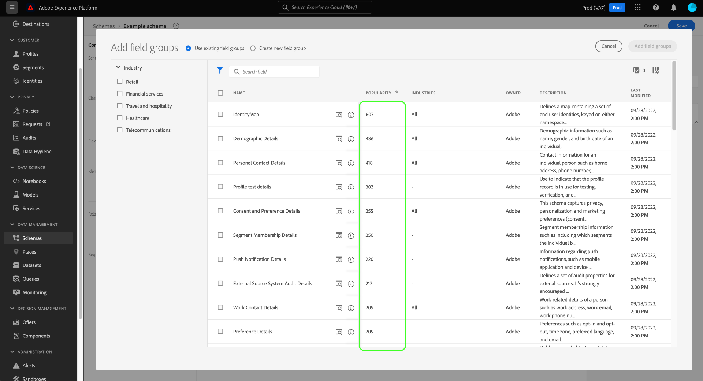

# 在UI中创建和编辑架构

本指南概述了如何在Adobe Experience Platform UI中为贵组织创建、编辑和管理Experience Data Model(XDM)模式。

>[!IMPORTANT]
>
>XDM架构是完全可自定义的，因此创建架构时涉及的步骤可能会因您希望架构捕获的数据类型而异。 因此，本文档仅涵盖您在UI中与架构进行的基本交互，并排除了自定义类、架构字段组、数据类型和字段等相关步骤。
>
>有关架构创建过程的完整教程，请按照[架构创建教程](../../tutorials/create-schema-ui.md)创建完整的示例架构，并熟悉[!DNL Schema Editor]的许多功能。

## 先决条件

本指南需要对XDM系统有一定的了解。 请参阅[XDM概述](../../home.md) ，了解XDM在Experience Platform生态系统中的角色，以及架构组合的[基础知识](../../schema/composition.md) ，以了解架构构建方式的概述。

## 创建新架构 {#create}

在[!UICONTROL 架构]工作区中，选择右上角的&#x200B;**[!UICONTROL 创建架构]** 。 在显示的下拉列表中，您可以选择&#x200B;**[!UICONTROL XDM Individual Profile]**&#x200B;和&#x200B;**[!UICONTROL XDM ExperienceEvent]**&#x200B;作为架构的基类。 或者，您也可以选择&#x200B;**[!UICONTROL Browse]**&#x200B;从可用类的完整列表中进行选择，或者选择[创建一个新的自定义类](./classes.md#create)。

选择类后，将显示[!DNL Schema Editor] ，并且画布中显示架构的基本结构（由类提供）。 从此处，您可以使用右边栏为架构添加&#x200B;**[!UICONTROL 显示名称]**&#x200B;和&#x200B;**[!UICONTROL 描述]**。

现在，您可以通过[添加架构字段组](#add-field-groups)来开始构建架构的结构。

## 编辑现有架构 {#edit}

>[!NOTE]
>
>保存架构并在数据摄取中使用后，只能对其进行附加更改。 有关更多信息，请参阅[架构演变规则](../../schema/composition.md#evolution) 。

要编辑现有架构，请选择&#x200B;**[!UICONTROL Browse]**&#x200B;选项卡，然后选择要编辑的架构的名称。

>[!TIP]
>
>您可以使用工作区的搜索和筛选功能来帮助更轻松地查找架构。 有关更多信息，请参阅[探索XDM资源](../explore.md)指南。

选择某个架构后，将显示[!DNL Schema Editor]，画布中会显示该架构的结构。 现在，您可以将[字段组](#add-field-groups)添加到架构中，或将[编辑字段显示名称](#display-names)，或者在架构采用任何类型时编辑现有自定义字段组](./field-groups.md#edit)。[

## 将字段组添加到架构 {#add-field-groups}

>[!NOTE]
>
>本节介绍如何将现有字段组添加到架构。 如果要创建新的自定义字段组，请参阅[创建和编辑字段组](./field-groups.md#create)中的指南。

在[!DNL Schema Editor]中打开架构后，您可以使用字段组向架构添加字段。 要开始，请选择左边栏中&#x200B;**[!UICONTROL 字段组]**&#x200B;旁边的&#x200B;**[!UICONTROL 添加]**。

此时会出现一个对话框，其中显示了可为架构选择的字段组列表。 由于字段组只与一个类兼容，因此将只列出与架构的选定类关联的那些字段组。 默认情况下，列出的字段组会根据其在您组织内的使用受欢迎程度进行排序。

如果您知道要添加的字段的常规活动或业务区域，请在左边栏中选择一个或多个垂直行业类别，以过滤显示的字段组列表。

>[!NOTE]
>
>有关XDM中特定于行业的数据建模最佳实践的更多信息，请参阅[行业数据模型](../../schema/industries/overview.md)的文档。

您还可以使用搜索栏帮助查找所需的字段组。 名称与查询匹配的字段组显示在列表顶部。 在&#x200B;**[!UICONTROL 标准字段]**&#x200B;下，将显示包含描述所需数据属性的字段的字段组。

选中要添加到架构的字段组名称旁边的复选框。 您可以从列表中选择多个字段组，每个选定的字段组都显示在右边栏中。

>[!TIP]
>
>对于任何列出的字段组，您可以将鼠标悬停在信息图标()上或集中在该信息图标上，以查看字段组捕获的数据类型的简要描述。 在决定将字段添加到架构之前，您还可以选择预览图标()以查看字段组提供的字段结构。

选择字段组后，选择&#x200B;**[!UICONTROL 添加字段组]**&#x200B;以将它们添加到架构。

[!DNL Schema Editor]将重新显示，画布中将显示字段组提供的字段。

## 为实时客户用户档案启用架构 {#profile}

[实时客户资料](../../../profile/home.md) 从不同的来源中提取数据，以构建每个客户的完整视图。如果希望架构捕获的数据参与此过程，则必须启用该架构以在[!DNL Profile]中使用。

>[!IMPORTANT]
>
>要启用[!DNL Profile]的架构，必须定义主标识字段。 有关更多信息，请参阅[定义标识字段](../fields/identity.md)的指南。

要启用架构，请首先在左边栏中选择架构的名称，然后选择右边栏中的&#x200B;**[!UICONTROL 配置文件]**&#x200B;切换开关。

此时会出现一个弹出窗口，警告您在启用并保存架构后，便无法禁用该架构。 选择&#x200B;**[!UICONTROL 启用]**&#x200B;以继续。

在启用[!UICONTROL Profile]切换开关后，画布将重新显示。

>[!IMPORTANT]
>
>由于架构尚未保存，因此如果您改变主意让架构参与实时客户资料，则此点不会返回：保存已启用的架构后，便无法再将其禁用。 再次选择&#x200B;**[!UICONTROL 配置文件]**&#x200B;切换开关以禁用架构。

要完成该过程，请选择&#x200B;**[!UICONTROL 保存]**&#x200B;以保存架构。

此架构现已启用，可在实时客户资料中使用。 当Platform根据此架构将数据摄取到数据集时，该数据将并入合并的用户档案数据中。

## 编辑架构字段的显示名称 {#display-names}

在为架构分配了类并将字段组添加到架构后，您可以编辑该架构中任何字段的显示名称，而不管这些字段是由标准XDM资源还是自定义XDM资源提供。

>[!NOTE]
>
>请记住，属于标准类或字段组的字段的显示名称只能在特定架构的上下文中编辑。 换言之，更改一个架构中标准字段的显示名称不会影响使用相同关联类或字段组的其他架构。
>
>更改架构字段的显示名称后，这些更改会立即反映在基于该架构的任何现有数据集中。

要编辑架构字段的显示名称，请在画布中选择该字段。 在右边栏的&#x200B;**[!UICONTROL 显示名称]**&#x200B;下提供新名称。

选择右边栏中的&#x200B;**[!UICONTROL Apply]**，画布会更新以显示字段的新显示名称。 选择&#x200B;**[!UICONTROL Save]**&#x200B;以将更改应用到架构。

## 更改架构的类 {#change-class}

在保存架构之前，您可以在初始合成过程中的任意时刻更改架构的类。

>[!WARNING]
>
>重新分配模式的类时应格外谨慎。 字段组仅与某些类兼容，因此更改类将重置画布和您添加的任何字段。

要重新分配类，请在画布的左侧选择&#x200B;**[!UICONTROL Assign]**。

此时会出现一个对话框，其中显示所有可用类的列表，包括贵组织定义的任何类（所有者为“[!UICONTROL Customer]”）以及由Adobe定义的标准类。

从列表中选择一个类，以在对话框的右侧显示其说明。 您还可以选择&#x200B;**[!UICONTROL 预览类结构]**&#x200B;以查看与该类关联的字段和元数据。 选择&#x200B;**[!UICONTROL Assign class]**&#x200B;以继续。

此时将打开一个新对话框，要求您确认您希望分配一个新类。 选择&#x200B;**[!UICONTROL 分配]**&#x200B;进行确认。

确认类更改后，画布将重置，所有合成进度都将丢失。

## 后续步骤

本文档介绍了在Platform UI中创建和编辑架构的基础知识。 强烈建议您查看[架构创建教程](../../tutorials/create-schema-ui.md) ，以了解在UI中构建完整架构的全面工作流，包括为独特用例创建自定义字段组和数据类型。

有关[!UICONTROL Schema]工作区功能的更多信息，请参阅[[!UICONTROL Schema]工作区概述](../overview.md)。

要了解如何在[!DNL Schema Registry] API中管理架构，请参阅[架构端点指南](../../api/schemas.md)。
