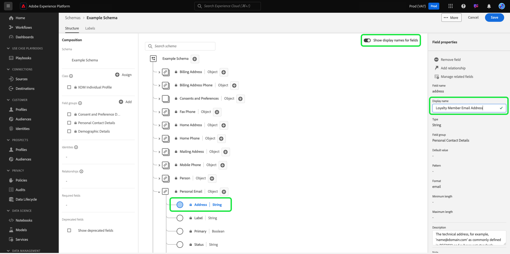

# 在UI中创建和编辑模式

本指南概述了如何在Adobe Experience PlatformUI中为您的组织创建、编辑和管理体验模式模型(XDM)。

>[!IMPORTANT]
>
>XDM模式是极其可自定义的，因此创建模式涉及的步骤可能因您希望模式捕获的数据类型而异。 因此，此文档仅涵盖您可以在UI中与模式进行的基本交互，并排除自定义类、混合、数据类型和字段等相关步骤。
>
>有关模式创建过程的完整演示，请按照[模式创建教程](../../tutorials/create-schema-ui.md)创建完整的示例模式，并熟悉[!DNL Schema Editor]的许多功能。

## 先决条件

本指南要求对XDM系统有有效的了解。 有关XDM在Experience Platform生态系统中的作用的介绍，请参阅[XDM概述](../../home.md)；有关如何构建模式的概述，请参阅[模式组合基础知识](../../schema/composition.md)。

## 创建新模式{#create}

在[!UICONTROL 模式]工作区中，选择右上角的&#x200B;**[!UICONTROL 创建模式]**。 在显示的下拉框中，您可以选择&#x200B;**[!UICONTROL XDM单个用户档案]**&#x200B;和&#x200B;**[!UICONTROL XDM ExperienceEvent]**&#x200B;作为模式的基类。 或者，您也可以选择&#x200B;**[!UICONTROL 浏览]**&#x200B;以从可用类的完整列表中进行选择，或者改为创建新的自定义类](./classes.md#create)。[

选择类后，[!DNL Schema Editor]将出现，画布中将显示模式的基本结构（由类提供）。 在此处，您可以使用右边栏为模式添加&#x200B;**[!UICONTROL 显示名称]**&#x200B;和&#x200B;**[!UICONTROL 说明]**。

您现在可以通过添加mixins](#add-mixins)来开始构建模式结构。[

## 编辑现有模式{#edit}

>[!NOTE]
>
>保存模式并将其用于数据获取后，只能对其进行附加更改。 有关详细信息，请参阅[模式演化规则](../../schema/composition.md#evolution)。

要编辑现有模式，请选择&#x200B;**[!UICONTROL 浏览]**&#x200B;选项卡，然后选择要编辑的模式的名称。

>[!TIP]
>
>您可以使用工作区的搜索和筛选功能来帮助更轻松地查找模式。 有关详细信息，请参见[探索XDM资源](../explore.md)的指南。

选择模式后，[!DNL Schema Editor]将显示，画布中显示模式的结构。 现在，您可以[向模式添加mixins](#add-mixins)、[编辑字段显示名称](#display-names)或[编辑现有的自定义mixins](./mixins.md#edit)(如果模式采用任何类型)。

## 向模式{#add-mixins}添加混音

>[!NOTE]
>
>本节介绍如何向模式添加现有混音。 如果要创建新的自定义混音，请参阅[创建和编辑混音](./mixins.md#create)的指南。

在[!DNL Schema Editor]中打开模式后，可以通过使用mixins将字段添加到模式。 要开始，请在左边栏中的&#x200B;**[!UICONTROL Mixins]**&#x200B;旁边选择&#x200B;**[!UICONTROL 添加]**。

将显示一个对话框，其中显示可为列表选择的混音模式。 由于混音只与一个类兼容，因此将仅列出与模式的选定类关联的混音。 默认情况下，列出的混音会根据其在组织内的使用受欢迎程度进行排序。

您可以使用搜索栏帮助查找所需的混音。 其名称与查询匹配的混音显示在列表的顶部。 在&#x200B;**[!UICONTROL 标准字段]**&#x200B;下，将显示包含描述所需数据属性的字段的混音。

选中要添加到模式的混音名称旁的复选框。 您可以从列表中选择多个混音，每个选定的混音显示在右边栏中。

>[!TIP]
>
>对于列出的任何混音，您可以悬停或专注于信息图标()，以视图混音捕获的数据类型的简短描述。 在您决定将其添加到预览之前，还可以选择视图图标()来模式混音所提供字段的结构。

选择您的混音后，选择&#x200B;**[!UICONTROL 添加混音]**&#x200B;将它们添加到模式。

[!DNL Schema Editor]将重新显示，画布中显示混音提供的字段。

## 启用实时模式用户档案{#profile}

[实时客户概](../../../profile/home.md) 要分析从不同来源收集数据，构建每个客户的完整视图。如果希望模式捕获的数据参与此过程，则必须启用模式才能在[!DNL Profile]中使用。

>[!IMPORTANT]
>
>要为[!DNL Profile]启用模式，它必须定义主标识字段。 有关详细信息，请参见[定义标识字段](../fields/identity.md)的指南。

要启用模式，请在左边栏中选择模式的名称，然后在右边栏中选择&#x200B;**[!UICONTROL 用户档案]**&#x200B;切换。

此时会显示一个弹出窗口，警告您在启用并保存模式后，将无法禁用它。 选择&#x200B;**[!UICONTROL 启用]**&#x200B;以继续。

画布将重新显示，并启用[!UICONTROL 用户档案]切换。

>[!IMPORTANT]
>
>由于模式尚未保存，因此如果您改变主意让模式参与实时客户用户档案，则此点不会返回：保存已启用的模式后，便无法再禁用它。 再次选择&#x200B;**[!UICONTROL 用户档案]**&#x200B;切换以禁用模式。

要完成该过程，请选择&#x200B;**[!UICONTROL 保存]**&#x200B;以保存模式。

该模式现在可用于实时客户用户档案。 当平台根据此模式将数据引入数据集时，该数据将并入合并的用户档案数据中。

## 编辑模式字段{#display-names}的显示名称

在为模式分配了类并添加了混音后，您可以编辑任何模式字段的显示名称，而不管这些字段是由标准XDM资源提供还是由自定义XDM资源提供。

>[!NOTE]
>
>请记住，属于标准类或混合的字段的显示名称只能在特定模式的上下文中进行编辑。 换句话说，在一个模式中更改标准字段的显示名称不会影响使用相同关联类或混音的其他模式。

要编辑模式字段的显示名称，请在画布中选择该字段。 在右边栏中，在&#x200B;**[!UICONTROL 显示名称]**&#x200B;下提供新名称。

选择右边栏中的&#x200B;**[!UICONTROL 应用]**，画布将更新以显示字段的新显示名称。 选择&#x200B;**[!UICONTROL 保存]**&#x200B;以将更改应用于模式。

## 更改模式的类{#change-class}

在保存模式之前，您可以在初始合成过程中的任意点更改模式的类。

>[!WARNING]
>
>重新分配模式的课程时应非常谨慎。 Mixin只与某些类兼容，因此更改类将重置画布和已添加的任何字段。

要重新分配类，请在画布左侧选择&#x200B;**[!UICONTROL 分配]**。

将显示一个对话框，其中显示所有可用类的列表，包括由您的组织定义的任何类（所有者为“[!UICONTROL Customer]”）以及由Adobe定义的标准类。

从列表中选择一个类，在对话框的右侧显示其说明。 您还可以选择&#x200B;**[!UICONTROL 预览类结构]**&#x200B;来查看与该类关联的字段和元数据。 选择&#x200B;**[!UICONTROL 分配类]**&#x200B;以继续。

此时会打开一个新对话框，要求您确认要分配新类。 选择&#x200B;**[!UICONTROL 分配]**&#x200B;进行确认。

确认类更改后，画布将重置，所有合成进度将丢失。

## 后续步骤

此文档涵盖在平台UI中创建和编辑模式的基础知识。 强烈建议您阅读[模式创建教程](../../tutorials/create-schema-ui.md)，了解在UI中构建完整模式的全面工作流，包括为独特用例创建自定义混音和数据类型。

有关[!UICONTROL 模式]工作区功能的详细信息，请参阅[[!UICONTROL 模式]工作区概述](../overview.md)。

要了解如何在[!DNL Schema Registry] API中管理模式，请参阅[模式端点指南](../../api/schemas.md)。