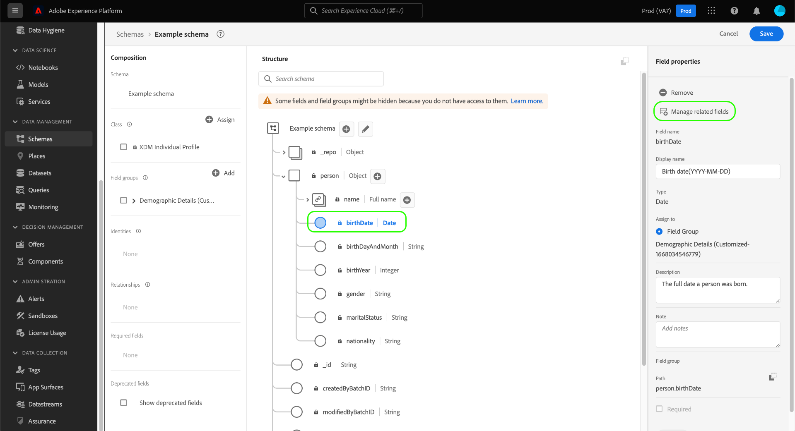

# 在UI中创建和编辑架构

本指南概述了如何在Adobe Experience Platform UI中为贵组织创建、编辑和管理Experience Data Model(XDM)模式。

>[!IMPORTANT]
>
>XDM架构是完全可自定义的，因此创建架构时涉及的步骤可能会因您希望架构捕获的数据类型而异。 因此，本文档仅涵盖您在UI中与架构进行的基本交互，并排除了自定义类、架构字段组、数据类型和字段等相关步骤。
>
>有关模式创建过程的完整教程，请遵循 [模式创建教程](../../tutorials/create-schema-ui.md) 创建完整的示例模式，并熟悉 [!DNL Schema Editor].

## 先决条件

本指南需要对XDM系统有一定的了解。 请参阅 [XDM概述](../../home.md) 介绍XDM在Experience Platform生态系统中的作用，以及 [架构组合基础知识](../../schema/composition.md) 概述如何构建模式。

## 创建新架构 {#create}

在 [!UICONTROL 模式] 工作区，选择 **[!UICONTROL 创建架构]** 中。 在显示的下拉菜单中，您可以选择 **[!UICONTROL XDM个人配置文件]** 和 **[!UICONTROL XDM ExperienceEvent]** 作为架构的基类。 或者，您也可以选择 **[!UICONTROL 浏览]** 从可用类的完整列表中进行选择，或 [创建新的自定义类](./classes.md#create) 中。

选择类后， [!DNL Schema Editor] 将显示，并且架构的基本结构（由类提供）将显示在画布中。 从此处，您可以使用右边栏添加 **[!UICONTROL 显示名称]** 和 **[!UICONTROL 描述]** 的子目录。

您现在可以通过 [添加架构字段组](#add-field-groups).

## 编辑现有架构 {#edit}

>[!NOTE]
>
>保存架构并在数据摄取中使用后，只能对其进行附加更改。 请参阅 [模式演化规则](../../schema/composition.md#evolution) 以了解更多信息。

要编辑现有架构，请选择 **[!UICONTROL 浏览]** 选项卡，然后选择要编辑的架构的名称。

>[!TIP]
>
>您可以使用工作区的搜索和筛选功能来帮助更轻松地查找架构。 请参阅 [浏览XDM资源](../explore.md) 以了解更多信息。

选择架构后， [!DNL Schema Editor] 显示，画布中显示了架构的结构。 您现在可以 [添加字段组](#add-field-groups) 到架构(或 [添加单个字段](#add-individual-fields) ), [编辑字段显示名称](#display-names)或 [编辑现有自定义字段组](./field-groups.md#edit) 如果架构使用任何。

## 将字段组添加到架构 {#add-field-groups}

>[!NOTE]
>
>本节介绍如何将现有字段组添加到架构。 如果要创建新的自定义字段组，请参阅 [创建和编辑字段组](./field-groups.md#create) 中。

在中打开架构后 [!DNL Schema Editor]，则可以通过使用字段组将字段添加到架构。 要开始，请选择 **[!UICONTROL 添加]** 下一页 **[!UICONTROL 字段组]** 中。

此时会出现一个对话框，其中显示了可为架构选择的字段组列表。 由于字段组只与一个类兼容，因此将只列出与架构的选定类关联的那些字段组。 默认情况下，列出的字段组会根据其在您组织内的使用受欢迎程度进行排序。

如果您知道要添加的字段的一般活动或业务区域，请在左边栏中选择一个或多个垂直行业类别，以过滤显示的字段组列表。

>[!NOTE]
>
>有关XDM中特定于行业的数据建模最佳实践的更多信息，请参阅 [行业数据模型](../../schema/industries/overview.md).

您还可以使用搜索栏帮助查找所需的字段组。 名称与查询匹配的字段组显示在列表顶部。 在 **[!UICONTROL 标准字段]**，则会显示包含描述所需数据属性的字段的字段组。

选中要添加到架构的字段组名称旁边的复选框。 您可以从列表中选择多个字段组，每个选定的字段组都显示在右边栏中。

>[!TIP]
>
>对于列出的任何字段组，您可以将鼠标悬停或集中在信息图标()以查看字段组捕获的数据类型的简要描述。 您还可以选择预览图标()以查看字段组提供的字段结构，然后再决定将其添加到架构。

选择字段组后，选择 **[!UICONTROL 添加字段组]** 以将其添加到架构。

的 [!DNL Schema Editor] 重新显示，画布中显示的字段组提供的字段。

在将字段组添加到架构后，您可以选择 [删除现有字段](#remove-fields) 或 [添加新自定义字段](#add-fields) 根据您的需要，将其添加到这些组。

### 删除从字段组添加的字段 {#remove-fields}

在将字段组添加到架构后，您可以删除不需要的任何字段。

>[!NOTE]
>
>从字段组中删除字段仅会影响正在处理的架构，而不会影响字段组本身。 如果删除一个架构中的字段，则这些字段在采用相同字段组的所有其他架构中仍然可用。

在以下示例中，标准字段组 **[!UICONTROL 人口统计详细信息]** 已添加到架构中。 删除单个字段，例如 `taxId`，选择画布中的字段，然后选择 **[!UICONTROL 删除]** 中。

如果要删除多个字段，则可以将字段组作为一个整体进行管理。 在画布中选择属于该组的字段，然后选择 **[!UICONTROL 管理相关字段]** 中。

将显示一个对话框，其中显示了相关字段组的结构。 从此处，您可以使用提供的复选框来选择或取消选择所需的字段。 当您满意时，选择 **[!UICONTROL 确认]**.

画布将重新显示，只显示架构结构中存在的选定字段。

### 向字段组添加自定义字段 {#add-fields}

在将字段组添加到架构后，您可以为该组定义其他字段。 但是，添加到一个架构中字段组的任何字段也将显示在使用该同一字段组的所有其他架构中。

此外，如果将自定义字段添加到标准字段组，则该字段组将转换为自定义字段组，并且原始标准字段组将不再可用。

如果要向标准字段组添加自定义字段，请参阅 [下方](#custom-fields-for-standard-groups) 以了解具体说明。 如果要向自定义字段组添加字段，请参阅 [编辑自定义字段组](./field-groups.md) 字段组UI指南中的。

如果不想更改任何现有字段组，则可以 [创建新的自定义字段组](./field-groups.md#create) 来定义其他字段。

## 将单个字段添加到架构 {#add-individual-fields}

如果希望避免为特定用例添加整个字段组，则使用架构编辑器可以直接将单个字段添加到架构中。 您可以 [从标准字段组添加单个字段](#add-standard-fields) 或 [添加您自己的自定义字段](#add-custom-fields) 中。

>[!IMPORTANT]
>
>即使在架构编辑器的功能上允许您将单个字段直接添加到架构中，但这并不会改变以下事实：XDM架构中的所有字段都必须由其类或与该类兼容的字段组提供。 如以下各节所述，在将各个字段添加到架构时，作为关键步骤，所有这些字段仍与类或字段组关联。

### 添加标准字段 {#add-standard-fields}

您可以将标准字段组中的字段直接添加到架构，而无需事先知道其相应的字段组。 要向架构添加标准字段，请选择加号(**+**)图标。 安 **[!UICONTROL 无标题字段]** 占位符显示在架构结构中，并且右侧边栏会更新，以显示用于配置字段的控件。

在 **[!UICONTROL 字段名称]**，开始键入要添加的字段名称。 系统会自动搜索与查询匹配的标准字段，并在 **[!UICONTROL 推荐的标准字段]**，包括其所属的字段组。

虽然某些标准字段具有相同的名称，但其结构可能会因其来源的字段组而异。 如果标准字段嵌套在字段组结构的父对象中，则如果添加了子字段，则父字段也将包含在架构中。

选择预览图标()以查看其字段组的结构，并更好地了解其嵌套方式。 要将标准字段添加到架构，请选择加号图标()。

画布会更新，以显示已添加到架构的标准字段，包括该架构嵌套在字段组结构下的任何父字段。 字段组的名称也列在 **[!UICONTROL 字段组]** 中。 如果要从同一字段组添加更多字段，请选择 **[!UICONTROL 管理相关字段]** 中。

### 添加自定义字段 {#add-custom-fields}

与标准字段的工作流类似，您还可以将自己的自定义字段直接添加到架构中。

要将字段添加到架构的根级别，请选择加号(**+**)图标。 安 **[!UICONTROL 无标题字段]** 占位符显示在架构结构中，并且右侧边栏会更新，以显示用于配置字段的控件。

开始在要添加的字段名称中键入内容，系统将自动开始搜索匹配的标准字段。 要改为创建新的自定义字段，请选择附加的顶部选项 **([!UICONTROL 新建字段])**.

为字段提供显示名称和数据类型后，下一步是将字段分配给父XDM资源。 如果您的架构使用自定义类，则可以选择 [将字段添加到分配的类](#add-to-class) 或 [字段组](#add-to-field-group) 中。 但是，如果您的架构使用标准类，则只能将自定义字段分配给字段组。

#### 将字段分配给自定义字段组 {#add-to-field-group}

>[!NOTE]
>
>此部分仅介绍如何将字段分配给自定义字段组。 如果要改为使用新自定义字段扩展标准字段组，请参阅 [将自定义字段添加到标准字段组](#custom-fields-for-standard-groups).

在 **[!UICONTROL 分配给]**，选择 **[!UICONTROL 字段组]**. 如果您的架构使用标准类，则这是唯一可用的选项，默认情况下处于选中状态。

接下来，必须为要关联的新字段选择字段组。 开始在提供的文本输入中键入字段组的名称。 如果您有任何与输入匹配的现有自定义字段组，它们将显示在下拉列表中。 或者，您可以键入唯一名称以创建新字段组。

>[!WARNING]
>
>如果您选择了现有的自定义字段组，则采用该字段组的任何其他架构也将在您保存更改后继承新添加的字段。 因此，仅当您需要此类型的传播时，才应选择现有的字段组。 否则，您应该选择创建新的自定义字段组。

从列表中选择字段组后，选择 **[!UICONTROL 应用]**.

新字段将添加到画布中，并且名称位于 [租户ID](../../api/getting-started.md#know-your-tenant_id) 以避免与标准XDM字段冲突。 与新字段关联的字段组也显示在 **[!UICONTROL 字段组]** 中。

>[!NOTE]
>
>默认情况下，所选自定义字段组提供的其余字段将从架构中删除。 如果要向架构添加其中一些字段，请选择属于该组的字段，然后选择 **[!UICONTROL 管理相关字段]** 中。

#### 将字段分配给自定义类 {#add-to-class}

在 **[!UICONTROL 分配给]**，选择 **[!UICONTROL 类]**. 下面的输入字段将替换为当前架构的自定义类的名称，这表示新字段将分配给此类。

![的 [!UICONTROL 类] 选项。](../../images/ui/resources/schemas/assign-field-to-class.png)

根据需要继续配置字段，然后选择 **[!UICONTROL 应用]** 完成。

![[!UICONTROL 应用] 为新字段选择。](../../images/ui/resources/schemas/assign-field-to-class-apply.png)

新字段将添加到画布中，并且名称位于 [租户ID](../../api/getting-started.md#know-your-tenant_id) 以避免与标准XDM字段冲突。 选择左边栏中的类名称会显示新字段作为类结构的一部分。

### 将自定义字段添加到标准字段组的结构 {#custom-fields-for-standard-groups}

如果您正在处理的架构具有由标准字段组提供的对象类型字段，则可以向该标准对象添加您自己的自定义字段。

>[!WARNING]
>
>在一个架构中添加到字段组的任何字段也将显示在使用该相同字段组的所有其他架构中。 此外，如果将自定义字段添加到标准字段组，则该字段组将转换为自定义字段组，并且原始标准字段组将不再可用。
>
>如果您参与了此功能的测试版，您将收到一个对话框，告知您之前自定义的标准字段组。 选择 **[!UICONTROL 确认]**，则列出的资源将转换为自定义字段组。
>
>

要开始，请选择加号(**+**)图标。

出现警告消息，提示您确认是否要转换标准字段组。 选择 **[!UICONTROL 继续创建字段组]** 以继续。

画布将重新显示，并显示新字段的无标题占位符。 请注意，标准字段组的名称已附加“([!UICONTROL 扩展])”，表示已从原始版本修改该版本。 从此处，使用右边栏中的控件定义字段的属性。

应用更改后，新字段将显示在标准对象中的租户ID命名空间下。 此嵌套命名空间可防止字段组本身内的字段名称冲突，以避免破坏使用同一字段组的其他架构中的更改。

## 为实时客户用户档案启用架构 {#profile}

>[!CONTEXTUALHELP]
>id="platform_schemas_enableforprofile"
>title="为配置文件启用架构"
>abstract="为配置文件启用架构后，从此架构创建的任何数据集都将参与实时客户配置文件，该配置文件可合并来自不同来源的数据以构建每个客户的完整视图。 使用架构将数据摄取到配置文件后，便无法禁用该架构。 有关详细信息，请参阅文档。"

[实时客户资料](../../../profile/home.md) 合并来自不同来源的数据，以构建每个客户的完整视图。 如果您希望架构捕获的数据参与此过程，则必须启用该架构以在中使用 [!DNL Profile].

>[!IMPORTANT]
>
>为了为 [!DNL Profile]，则必须定义主标识字段。 请参阅 [定义标识字段](../fields/identity.md) 以了解更多信息。

要启用架构，请首先在左边栏中选择架构的名称，然后选择 **[!UICONTROL 用户档案]** 在右边栏中切换。

此时会出现一个弹出窗口，警告您在启用并保存架构后，便无法禁用该架构。 选择 **[!UICONTROL 启用]** 继续。

画布将重新显示，其中 [!UICONTROL 用户档案] 启用切换。

>[!IMPORTANT]
>
>由于架构尚未保存，因此如果您改变主意让架构参与实时客户资料，则此点不会返回：保存已启用的架构后，便无法再将其禁用。 选择 **[!UICONTROL 用户档案]** 再次切换以禁用架构。

要完成该过程，请选择 **[!UICONTROL 保存]** 以保存架构。

此架构现已启用，可在实时客户资料中使用。 当Platform根据此架构将数据摄取到数据集时，该数据将并入合并的用户档案数据中。

## 编辑架构字段的显示名称 {#display-names}

在为架构分配了类并将字段组添加到架构后，您可以编辑该架构中任何字段的显示名称，而不管这些字段是由标准XDM资源还是自定义XDM资源提供。

>[!NOTE]
>
>请记住，属于标准类或字段组的字段的显示名称只能在特定架构的上下文中编辑。 换言之，更改一个架构中标准字段的显示名称不会影响使用相同关联类或字段组的其他架构。
>
>更改架构字段的显示名称后，这些更改会立即反映在基于该架构的任何现有数据集中。

要编辑架构字段的显示名称，请在画布中选择该字段。 在右边栏中，在 **[!UICONTROL 显示名称]**.

选择 **[!UICONTROL 应用]** 在右边栏中，画布会更新以显示字段的新显示名称。 选择 **[!UICONTROL 保存]** 以将更改应用到架构。

## 更改架构的类 {#change-class}

在保存架构之前，您可以在初始合成过程中的任意时刻更改架构的类。

>[!WARNING]
>
>重新分配模式的类时应格外谨慎。 字段组仅与某些类兼容，因此更改类将重置画布和您添加的任何字段。

要重新分配类，请选择 **[!UICONTROL 分配]** 在画布的左侧。

此时会出现一个对话框，其中显示所有可用类的列表，包括您的组织定义的任何类(所有者为“[!UICONTROL 客户]“”)以及由Adobe定义的标准类。

从列表中选择一个类，以在对话框的右侧显示其说明。 您还可以选择 **[!UICONTROL 预览类结构]** 以查看与类关联的字段和元数据。 选择 **[!UICONTROL 分配类]** 继续。

此时将打开一个新对话框，要求您确认您希望分配一个新类。 选择 **[!UICONTROL 分配]** 确认。

确认类更改后，画布将重置，所有合成进度都将丢失。

## 后续步骤

本文档介绍了在Platform UI中创建和编辑架构的基础知识。 强烈建议您查看 [模式创建教程](../../tutorials/create-schema-ui.md) 有关在UI中构建完整架构的全面工作流，包括为独特用例创建自定义字段组和数据类型。

有关 [!UICONTROL 模式] 工作区，请参阅 [[!UICONTROL 模式] 工作区概述](../overview.md).

了解如何在 [!DNL Schema Registry] API，请参阅 [schema endpoint指南](../../api/schemas.md).
