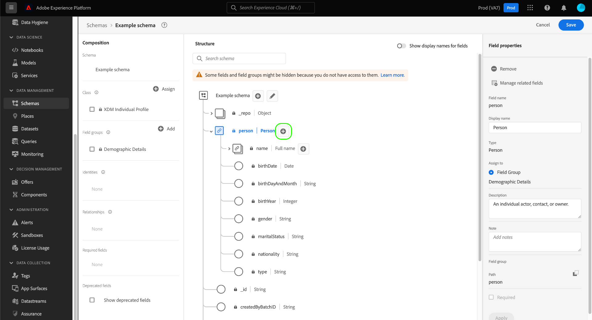

# 在UI中创建和编辑架构

本指南概述了如何在Adobe Experience Platform UI中为您的组织创建、编辑和管理Experience Data Model (XDM)架构。

>[!IMPORTANT]
>
>XDM架构极具可自定义性，因此，创建架构所涉及的步骤可能会因您希望架构捕获的数据类型而异。 因此，本文档仅介绍您可以在UI中使用架构进行的基本交互，并排除自定义类、架构字段组、数据类型和字段等相关步骤。
>
>有关模式创建过程的完整导览，请随附 [模式创建教程](../../tutorials/create-schema-ui.md) 创建一个完整的示例架构并熟悉 [!DNL Schema Editor].

## 先决条件

本指南要求您对XDM系统有一定的了解。 请参阅 [XDM概述](../../home.md) 介绍XDM在Experience Platform生态系统中的作用以及 [模式组合基础](../../schema/composition.md) 有关如何构建架构的概述。

## 创建新架构 {#create}

>[!NOTE]
>
>本节介绍如何在UI中手动创建新架构。 如果您正在将CSV数据摄取到平台，则可以选择 [将该数据映射到由AI生成的推荐创建的XDM架构](../../../ingestion/tutorials/map-csv/recommendations.md) （目前为测试版），无需自行手动创建架构。

在 [!UICONTROL 架构] 工作区，选择 **[!UICONTROL 创建架构]** 在右上角。 在显示的下拉菜单中，您可以选择 **[!UICONTROL XDM个人资料]** 和 **[!UICONTROL XDM ExperienceEvent]** 作为架构的基类。 或者，您可以选择 **[!UICONTROL 浏览]** 从可用类的完整列表中进行选择，或者 [创建新的自定义类](./classes.md#create) 而是。

选择一个类后， [!DNL Schema Editor] 随即会显示，并且架构的基本结构（由类提供）会显示在画布中。 在此处，您可以使用右边栏添加 **[!UICONTROL 显示名称]** 和 **[!UICONTROL 描述]** 用于架构。

您现在可以通过以下方式开始构建架构的结构 [添加架构字段组](#add-field-groups).

## 编辑现有架构 {#edit}

>[!NOTE]
>
>保存架构并将其用于数据摄取后，只能对其做出额外的更改。 请参阅 [模式演化规则](../../schema/composition.md#evolution) 了解更多信息。

要编辑现有架构，请选择 **[!UICONTROL 浏览]** 选项卡，然后选择要编辑的架构的名称。

>[!TIP]
>
>您可以使用工作区的搜索和筛选功能来帮助更轻松地查找架构。 请参阅指南，网址为 [探索XDM资源](../explore.md) 了解更多信息。

选择架构后， [!DNL Schema Editor] 随画布中显示的架构结构一起显示。 您现在可以 [添加字段组](#add-field-groups) 到架构(或 [添加单个字段](#add-individual-fields) 来自这些组)， [编辑字段显示名称](#display-names)，或 [编辑现有自定义字段组](./field-groups.md#edit) 如果架构使用任何。

## 显示名称切换 {#display-name-toggle}

为方便起见，架构编辑器在原始字段名称和更易于用户识别的显示名称之间提供切换开关。 这种灵活性可提高字段可发现性和架构的编辑。 此切换开关位于架构编辑器视图的右上角。

>[!NOTE]
>
>从字段名称到显示名称的更改纯粹是修饰性的，不会更改任何下游资源。

![架构编辑器 [!UICONTROL 显示字段的显示名称] 突出显示。](../../images/ui/resources/schemas/display-name-toggle.png)

标准字段组的显示名称由系统生成，但可以自定义，如 [显示名称](#display-names) 部分。 显示名称会反映在多个UI视图中，包括映射和数据集预览。 默认设置为off ，并按其原始值显示字段名称。

## 将字段组添加到架构 {#add-field-groups}

>[!NOTE]
>
>本节介绍如何将现有字段组添加到架构。 如果要创建新的自定义字段组，请参阅指南，网址为 [创建和编辑字段组](./field-groups.md#create) 而是。

在中打开架构后 [!DNL Schema Editor]中，您可以使用字段组向架构中添加字段。 要开始，请选择 **[!UICONTROL 添加]** 旁边 **[!UICONTROL 字段组]** 在左边栏中。

![架构编辑器具有 [!UICONTROL 添加] 从 [!UICONTROL 字段组] 部分突出显示。](../../images/ui/resources/schemas/add-field-group-button.png)

此时将显示一个对话框，其中显示了可为架构选择的字段组列表。 由于字段组仅与一个类兼容，因此将仅列出与架构的选定类关联的字段组。 默认情况下，列出的字段组会根据其在您组织中的使用人气进行排序。

如果您知道要添加字段的常规活动或业务领域，请在左边栏中选择一个或多个垂直行业的类别，以筛选显示的字段组列表。

>[!NOTE]
>
>有关XDM中特定行业数据建模的最佳实践的更多信息，请参阅以下文档： [行业数据模型](../../schema/industries/overview.md).

您还可以使用搜索栏帮助找到所需的字段组。 名称与查询匹配的字段组显示在列表顶部。 下 **[!UICONTROL 标准字段]**，将显示包含描述所需数据属性的字段的字段组。

选中要添加到架构的字段组名称旁边的复选框。 您可以从列表中选择多个字段组，每个选定的字段组都显示在右边栏中。

>[!TIP]
>
>对于任何列出的字段组，您可以将光标悬停在信息图标上或将其放在该信息图标上()，以查看字段组捕获的数据类型的简短描述。 您还可以选择预览图标()，以查看字段组提供的字段结构，然后再决定将其添加到架构。

选择字段组后，选择 **[!UICONTROL 添加字段组]** 以将其添加到架构中。

此 [!DNL Schema Editor] 重新显示，画布中表示字段组提供的字段。

将字段组添加到架构后，您可以选择执行以下操作 [删除现有字段](#remove-fields) 或 [添加新自定义字段](#add-fields) 根据您的需要，将这些组分为两类。

### 删除从字段组添加的字段 {#remove-fields}

将字段组添加到架构后，可以删除任何不需要的字段。

>[!NOTE]
>
>从字段组中删除字段只会影响正在处理的架构，而不会影响字段组本身。 如果删除一个架构中的字段，则这些字段在使用相同字段组的所有其他架构中仍然可用。

在以下示例中，标准字段组 **[!UICONTROL 人口统计详细信息]** 已添加到架构。 要删除单个字段，例如 `taxId`，选择画布中的字段，然后选择 **[!UICONTROL 移除]** 在右边栏中。

如果要删除多个字段，则可以整体管理字段组。 在画布中选择属于该组的字段，然后选择 **[!UICONTROL 管理相关字段]** 在右边栏中。

此时将显示一个对话框，其中显示了相关字段组的结构。 在此处，您可以使用提供的复选框选择或取消选择所需的字段。 满意后，选择 **[!UICONTROL 确认]**.

画布会重新显示，架构结构中只显示选定的字段。

### 将自定义字段添加到字段组 {#add-fields}

将字段组添加到架构后，可以为该组定义其他字段。 但是，添加到某个架构中字段组的任何字段也将出现在使用该字段组的所有其他架构中。

此外，如果将自定义字段添加到标准字段组，则该字段组将转换为自定义字段组，并且原始标准字段组将不再可用。

如果要将自定义字段添加到标准字段组，请参阅 [以下部分](#custom-fields-for-standard-groups) 以获取特定说明。 如果要向自定义字段组添加字段，请参阅以下章节： [编辑自定义字段组](./field-groups.md) 在字段组UI指南中。

如果不想更改任何现有的字段组，您可以 [创建新的自定义字段组](./field-groups.md#create) 以定义其他字段。

## 将单个字段添加到架构 {#add-individual-fields}

如果要避免为特定用例添加整个字段组，可使用架构编辑器将单个字段直接添加到架构。 您可以 [从标准字段组添加单个字段](#add-standard-fields) 或 [添加您自己的自定义字段](#add-custom-fields) 而是。

>[!IMPORTANT]
>
>尽管架构编辑器在功能上允许您直接将各个字段添加到架构，但这不会更改XDM架构中的所有字段都必须由其类或与该类兼容的字段组提供。 正如以下各节所解释的，作为添加到架构的关键步骤，所有单个字段仍与类或字段组关联。

### 添加标准字段 {#add-standard-fields}

您可以将标准字段组中的字段直接添加到架构中，而无需预先知道其对应的字段组。 要将标准字段添加到架构，请选择加号(**+**)图标图标。 An **[!UICONTROL 无标题字段]** 架构结构中会显示占位符，右边栏更新会显示用于配置该字段的控件。

下 **[!UICONTROL 字段名称]**，开始键入要添加字段的名称。 系统会自动搜索与查询匹配的标准字段，并在下面列出它们 **[!UICONTROL 推荐的标准字段]**，包括它们所属的字段组。

虽然某些标准字段具有相同的名称，但它们的结构可能会因它们来自的字段组而异。 如果标准字段嵌套在字段组结构的父对象中，则添加子字段时，该父字段也将包含在架构中。

选择预览图标()，以查看其字段组的结构，并更好地了解如何嵌套该字段。 要将标准字段添加到架构，请选择加号图标()。

画布将更新以显示添加到架构的标准字段，包括嵌套在字段组结构下的任何父字段。 字段组的名称也会列在 **[!UICONTROL 字段组]** 在左边栏中。 如果要从同一字段组添加更多字段，请选择 **[!UICONTROL 管理相关字段]** 在右边栏中。

### 添加自定义字段 {#add-custom-fields}

与标准字段的工作流类似，您还可以将自己的自定义字段直接添加到架构。

要将字段添加到架构的根级别，请选择加号(**+**)图标图标。 An **[!UICONTROL 无标题字段]** 架构结构中会显示占位符，右边栏更新会显示用于配置该字段的控件。

开始键入要添加的字段的名称，系统会自动开始搜索匹配的标准字段。 要创建新的自定义字段，请选择附加了的顶部选项 **([!UICONTROL 新建字段])**.

为字段提供显示名称和数据类型后，下一步是将字段分配给父XDM资源。 如果您的架构使用自定义类，则可以选择 [将字段添加到分配的类](#add-to-class) 或 [字段组](#add-to-field-group) 而是。 但是，如果您的架构使用标准类，则只能将自定义字段分配给字段组。

#### 将字段分配给自定义字段组 {#add-to-field-group}

>[!NOTE]
>
>本节仅介绍如何将字段分配给自定义字段组。 如果要改用新的自定义字段扩展标准字段组，请参阅 [将自定义字段添加到标准字段组](#custom-fields-for-standard-groups).

下 **[!UICONTROL 分配给]**，选择 **[!UICONTROL 字段组]**. 如果您的架构使用标准类，则这是唯一可用的选项，默认情况下处于选中状态。

接下来，必须为要关联的新字段选择字段组。 在提供的文本输入中开始键入字段组的名称。 如果您有任何与输入匹配的现有自定义字段组，则它们将显示在下拉列表中。 或者，您可以键入唯一名称来创建新的字段组。

>[!WARNING]
>
>如果选择现有的自定义字段组，则在保存更改后，使用该字段组的任何其他架构也将继承新添加的字段。 因此，如果需要此类型的传播，请仅选择现有的字段组。 否则，您应该选择创建新的自定义字段组。

从列表中选择字段组后，选择 **[!UICONTROL 应用]**.

新字段将添加到画布中，并在下方 [租户ID](../../api/getting-started.md#know-your-tenant_id) 以避免与标准XDM字段冲突。 与新字段关联的字段组也显示在下方 **[!UICONTROL 字段组]** 在左边栏中。

>[!NOTE]
>
>默认情况下，所选自定义字段组提供的其余字段将从架构中删除。 如果要将其中一些字段添加到架构，请选择属于该组的字段，然后选择 **[!UICONTROL 管理相关字段]** 在右边栏中。

#### 将字段分配给自定义类 {#add-to-class}

下 **[!UICONTROL 分配给]**，选择 **[!UICONTROL 类]**. 下面的输入字段被替换为当前架构的自定义类的名称，指示新字段将被分配给此类。

![此 [!UICONTROL 类] 为新字段分配选择的选项。](../../images/ui/resources/schemas/assign-field-to-class.png)

继续根据需要配置字段并选择 **[!UICONTROL 应用]** 完成后。

![[!UICONTROL 应用] 被选定为新字段。](../../images/ui/resources/schemas/assign-field-to-class-apply.png)

新字段将添加到画布中，并在下方 [租户ID](../../api/getting-started.md#know-your-tenant_id) 以避免与标准XDM字段冲突。 选择左边栏中的类名称将显示新字段，作为类结构的一部分。

### 将自定义字段添加到标准字段组的结构 {#custom-fields-for-standard-groups}

如果您正在处理的架构具有由标准字段组提供的对象类型字段，则可以将自己的自定义字段添加到该标准对象。

>[!WARNING]
>
>添加到某个架构中字段组的任何字段也将出现在使用该字段组的所有其他架构中。 此外，如果将自定义字段添加到标准字段组，则该字段组将转换为自定义字段组，并且原始标准字段组将不再可用。
>
>如果您参与了此功能的测试版，您将看到一个对话框，告知您之前自定义的标准字段组。 一旦您选择 **[!UICONTROL 确认]**，则列出的资源将转换为自定义字段组。
>
>

要开始，请选择加号(**+**)图标来标记标准字段组提供的对象的根目录。

出现警告消息，提示您确认是否要转换标准字段组。 选择 **[!UICONTROL 继续创建字段组]** 以继续。

画布会重新显示，新字段的占位符无标题。 请注意，标准字段组的名称已附加“(”[!UICONTROL 扩展])”以指示它已从原始版本修改。 从此处，使用右边栏中的控件来定义字段的属性。

应用更改后，新字段将显示在标准对象中的租户ID命名空间下。 此嵌套命名空间可防止字段组自身内的字段名称冲突，以避免破坏使用同一字段组的其他架构中的更改。

## 为Real-time Customer Profile启用架构 {#profile}

>[!CONTEXTUALHELP]
>id="platform_schemas_enableforprofile"
>title="为配置文件启用架构"
>abstract="在为配置文件启用一个架构时，从该架构创建的任何数据集都会参与实时客户配置文件，此配置文件合并来自不同源的数据以构建每个客户的完整视图。使用架构将数据提取到配置文件中后，无法将其禁用。有关详细信息，请参阅文档。"

[Real-time Customer Profile](../../../profile/home.md) 合并来自不同来源的数据，以构建每个客户的完整视图。 如果您希望架构捕获的数据参与此过程，则必须启用架构以便用于 [!DNL Profile].

>[!IMPORTANT]
>
>为了启用架构，请 [!DNL Profile]，则必须定义主标识字段。 请参阅指南，网址为 [定义身份字段](../fields/identity.md) 了解更多信息。

要启用架构，请在左边栏中选择架构的名称，然后选择 **[!UICONTROL 个人资料]** 在右边栏中切换。

此时会出现一个弹出窗口，警告您一旦启用并保存了架构，就无法禁用该架构。 选择 **[!UICONTROL 启用]** 以继续。

画布将重新显示，并且 [!UICONTROL 个人资料] 切换已启用。

>[!IMPORTANT]
>
>由于架构尚未保存，如果您改变主意，让架构参与Real-Time Customer Profile，则无法返回此信息：保存启用的架构后，无法再禁用该架构。 选择 **[!UICONTROL 个人资料]** 再次切换可禁用架构。

要完成该过程，请选择 **[!UICONTROL 保存]** 以保存架构。

该架构现已启用以在Real-Time Customer Profile中使用。 当Platform将数据摄取到基于此架构的数据集时，该数据将合并到合并的用户档案数据中。

## 编辑架构字段的显示名称 {#display-names}

分配类并将字段组添加到架构后，可以编辑架构中任何字段的显示名称，无论这些字段是由标准资源还是自定义XDM资源提供。

>[!NOTE]
>
>请记住，属于标准类或字段组的字段的显示名称只能在特定架构的上下文中编辑。 换句话说，更改一个架构中标准字段的显示名称不会影响使用相同关联类或字段组的其他架构。
>
>一旦更改了架构字段的显示名称，这些更改就会立即反映在基于该架构的任何现有数据集中。

要编辑架构字段的显示名称，请在画布中选择该字段。 在右边栏中，在下面提供新名称 **[!UICONTROL 显示名称]**.

选择 **[!UICONTROL 应用]** 右边栏中，画布将更新以显示字段的新显示名称。 选择 **[!UICONTROL 保存]** 以将更改应用于架构。

## 更改架构的类 {#change-class}

在保存架构之前，您可以在初始构成过程中随时更改架构的类。

>[!WARNING]
>
>为架构重新分配类应极其谨慎。 字段组仅与某些类兼容，因此更改该类将重置画布和您已添加的任何字段。

要重新分配类，请选择 **[!UICONTROL 分配]** 在画布的左侧。

此时将显示一个对话框，其中包含所有可用类的列表，其中包括您的组织定义的任何类(所有者为&#39;&#39;[!UICONTROL 客户]“)以及Adobe定义的标准类。

从列表中选择一个类，以在对话框的右侧显示其说明。 您还可以选择 **[!UICONTROL 预览类结构]** 查看与类关联的字段和元数据。 选择 **[!UICONTROL 分配类]** 以继续。

此时将打开一个新对话框，要求您确认是否分配一个新类。 选择 **[!UICONTROL 分配]** 以确认。

确认类更改后，画布将重置，并且所有合成进度都将丢失。

## 后续步骤

本文档介绍了在Platform UI中创建和编辑架构的基础知识。 强烈建议您查看 [模式创建教程](../../tutorials/create-schema-ui.md) 用于在UI中构建完整架构的综合工作流，包括为独特用例创建自定义字段组和数据类型。

欲知关于 [!UICONTROL 架构] 工作区，请参见 [[!UICONTROL 架构] 工作区概述](../overview.md).

要了解如何在中管理架构，请执行以下操作 [!DNL Schema Registry] API，请参见 [架构端点指南](../../api/schemas.md).
