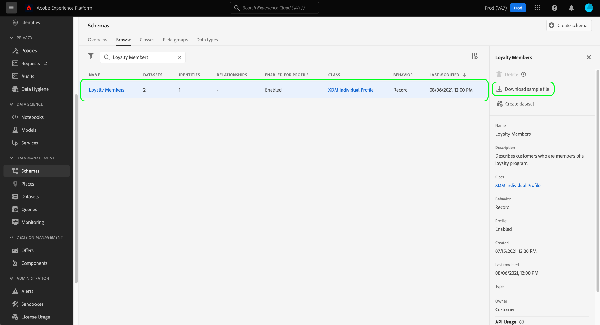

# 在 UI 中为 XDM 架构生成样本数据 {#generate-sample-data-for-an-xdm-schema}

>[!CONTEXTUALHELP]
>id="platform_xdm_downloadsamplefile"
>title="下载样本文件"
>abstract="生成符合您选择的架构结构的示例 JSON 对象。该对象可以作为模板，确保您的数据格式正确，以便纳入采用该架构的数据集中。您的浏览器将下载示例 JSON 文件。"

要将数据摄取到Adobe Experience Platform，数据的格式和结构必须符合现有的Experience Data Model (XDM)架构。 根据特定数据集的架构复杂性，可能很难确定数据集在摄取时预期的数据的确切形状。

对于您在Experience Platform UI中定义的任何架构，可以生成符合架构结构的示例JSON对象。 此对象可用作模板，用于提取到采用相关架构的数据集中的任何数据。

在Experience Platform UI的左侧导航中选择&#x200B;**[!UICONTROL Schemas]**。 在&#x200B;**[!UICONTROL Browse]**&#x200B;选项卡下，找到要为其生成示例数据的架构。 从列表中选择架构，右边栏将进行更新以显示有关架构的详细信息。 从此处选择&#x200B;**[!UICONTROL Download sample file]**。

浏览器下载了示例JSON文件。 现在，您可以使用此文件作为参考，了解在引入采用此架构的数据集时，如何构建数据。

## 后续步骤

本指南介绍了如何从Experience Platform UI中的XDM架构生成示例JSON文件。 要了解如何使用架构注册表API生成示例数据，请参阅[示例数据端点指南](../api/sample-data.md)。

准备好开始摄取数据后，请参阅有关[将CSV文件映射到XDM](../../ingestion/tutorials/map-csv/overview.md)的教程，了解如何将平面数据文件（如CSV）映射到XDM架构并将其摄取到Experience Platform。 或者，您可以建立[源连接](../../sources/home.md)以从外部源引入您的数据并将其映射到XDM。

有关UI中[!UICONTROL Schemas]工作区的功能的更多信息，请参阅[[!UICONTROL Schemas]工作区概述](./overview.md)。
